# Guía técnica: Configuración de un servidor de correo con iRedMail

**Alumno:** Santiago Hernández  
**Número de lista:** 10  
**Centro:** Escola Pia Santa Anna – Mataró  
**Sistema operativo:** Ubuntu Server  
**Herramienta principal:** iRedMail 1.8.0

***

## 1. Objetivo de la práctica

El objetivo de esta práctica es configurar un servidor de correo electrónico completamente funcional utilizando iRedMail sobre Ubuntu Server.  
Se configuran dominios, usuarios, envío y recepción de correos internos y externos, así como la revisión de registros (logs) y el análisis del comportamiento del correo frente a servicios externos como Gmail.

***

## 2. Preparación del entorno

### 2.1 Máquina virtual

Se utiliza una máquina virtual con las siguientes características:

*   Ubuntu Server 64 bits
*   4 GB de RAM
*   2 adaptadores de red:
    *   NAT
    *   Host-only

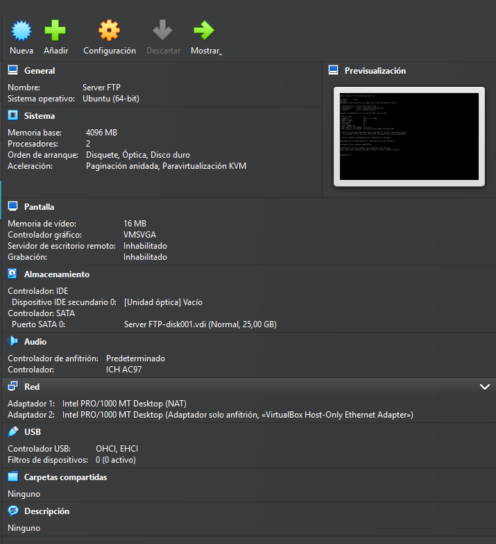 

Esto permite que el servidor tenga salida a Internet y, a la vez, acceso desde el equipo anfitrión.

**Imagen 1:** Configuración general de la máquina virtual en VirtualBox.

***

### 2.2 Configuración del hostname

Se define un nombre de host con el formato solicitado para el servidor de correo.

```
sudo hostnamectl set-hostname mx.serveis10.test
hostname
```

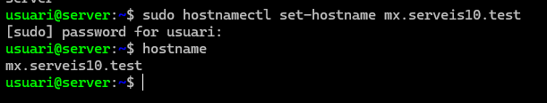 

El resultado muestra correctamente el hostname configurado:

```
mx.serveis10.test
```

**3:** Configuración y comprobación del hostname.

***

### 2.3 Configuración del archivo `/etc/hosts`

Se edita el archivo para asegurar la correcta resolución local del nombre del servidor:

```
sudo nano /etc/hosts
```

Contenido relevante:

```
127.0.0.1   localhost
127.0.1.1   mx.serveis10.test mx
```

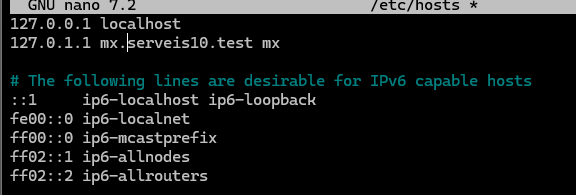 

Se comprueba que los cambios se han aplicado correctamente.

**4:** Edición y verificación del archivo `/etc/hosts`.

***

### 2.4 Verificación de red

Se revisa la configuración de red para confirmar que ambas interfaces están activas.

```
ip a
```

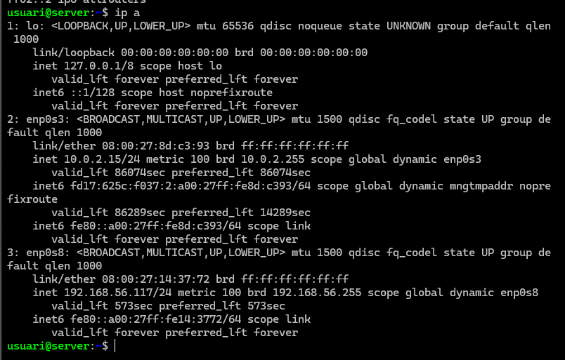 

Se observan:

*   Una IP privada asignada por NAT
*   Una IP del rango `192.168.56.0/24` para acceso desde el host

**:** Salida del comando `ip a`.

***

## 3. Instalación de iRedMail

### 3.1 Descarga del instalador

Se descarga la versión 1.8.0 de iRedMail desde GitHub y se descomprime.

```
wget https://github.com/iredmail/iRedMail/archive/refs/tags/1.8.0.tar.gz
```

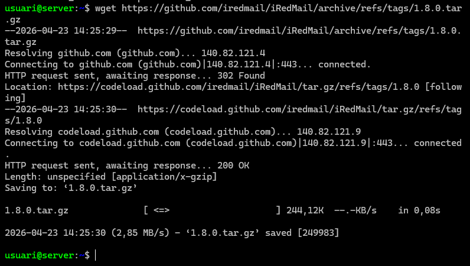

```
tar xzf 1.8.0.tar.gz
cd iRedMail-1.8.0
```

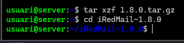


**:** Descarga y descompresión del instalador.

***

### 3.2 Ejecución del instalador

Se lanza el script de instalación:

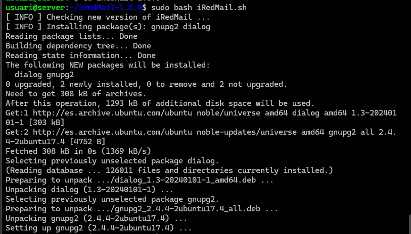

```
sudo bash iRedMail.sh
```

Durante el asistente se seleccionan las siguientes opciones:

*   Directorio de correos: `/var/vmail`
*   Servidor web: Nginx
*   Base de datos: MariaDB
*   Dominio inicial de correo: `tucat.test`
*   Administrador del dominio: `postmaster@tucat.test`

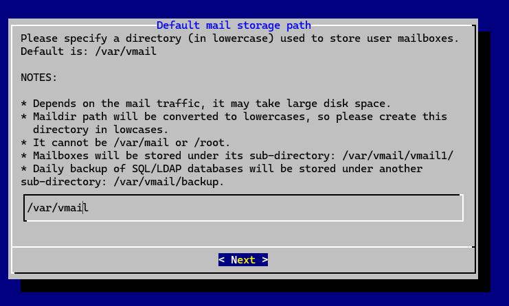
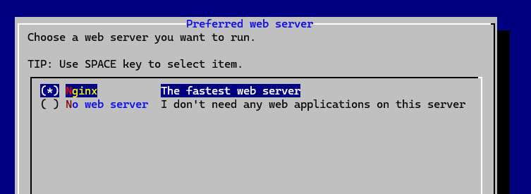
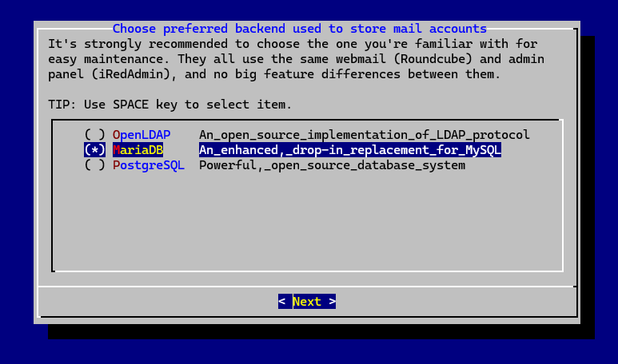
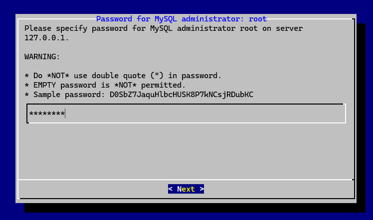
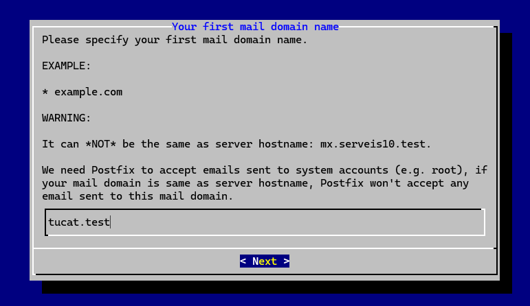
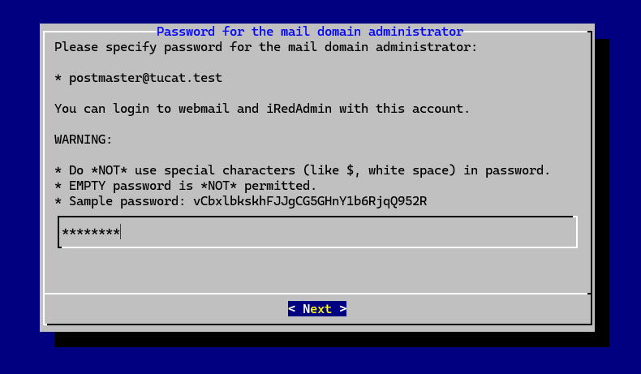
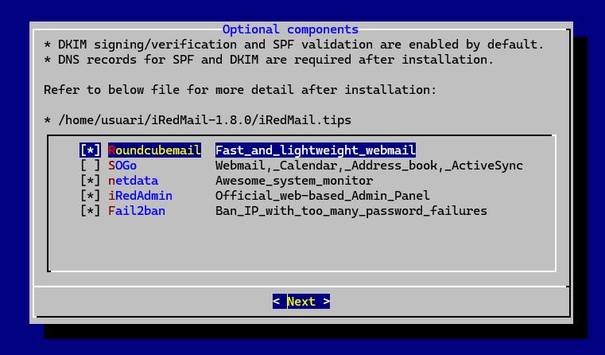


**:** Proceso de instalación y selección de opciones principales.

***

### 3.3 Componentes adicionales

Se activan los siguientes componentes:

*   Roundcube (webmail)
*   iRedAdmin (panel de administración)
*   Fail2ban
*   Netdata

**:** Selección de componentes adicionales.

***

### 3.4 Finalización de la instalación

Se aceptan las reglas de firewall propuestas por iRedMail y se reinicia el sistema para aplicar todos los servicios.

**:** Instalación finalizada correctamente.

Tras el reinicio se comprueba que Nginx está activo:

```
sudo systemctl status nginx
```

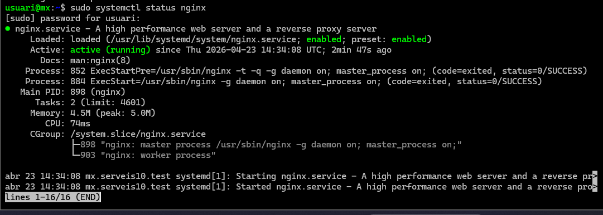


El servicio aparece en estado `active (running)`.

**:** Comprobación del servicio Nginx.

***

## 4. Administración del servidor de correo

### 4.1 Acceso a iRedAdmin

Se accede al panel de administración mediante el navegador:

    https://192.168.56.117/iredadmin

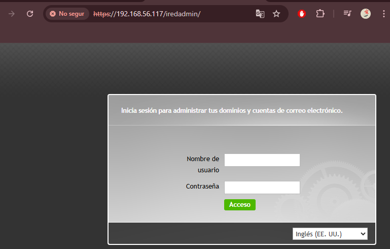

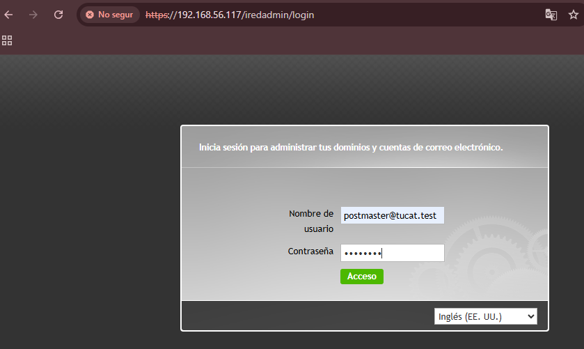

Se inicia sesión con el usuario administrador del dominio.

**:** Pantalla de inicio de sesión de iRedAdmin.

***

### 4.2 Comprobación del dominio principal

Desde el panel se verifica que el dominio `tucat.test` está creado correctamente y asignado al administrador.

**:** Dominio principal visible en iRedAdmin.

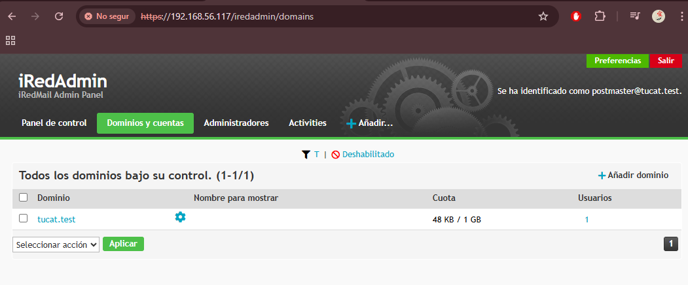

***

### 4.3 Logs de administración

En el apartado **Activities** se revisan los registros del sistema, donde se muestran:

*   Inicios de sesión
*   Creación de dominios
*   Creación y modificación de usuarios

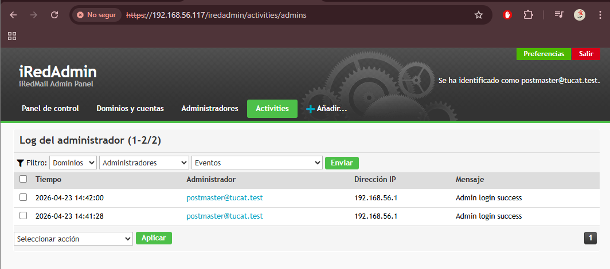


**:** Logs de actividad del administrador.

***

## 5. Creación de usuarios

### 5.1 Usuario en el dominio principal

Se crea el usuario:

    tucatito10@tucat.test

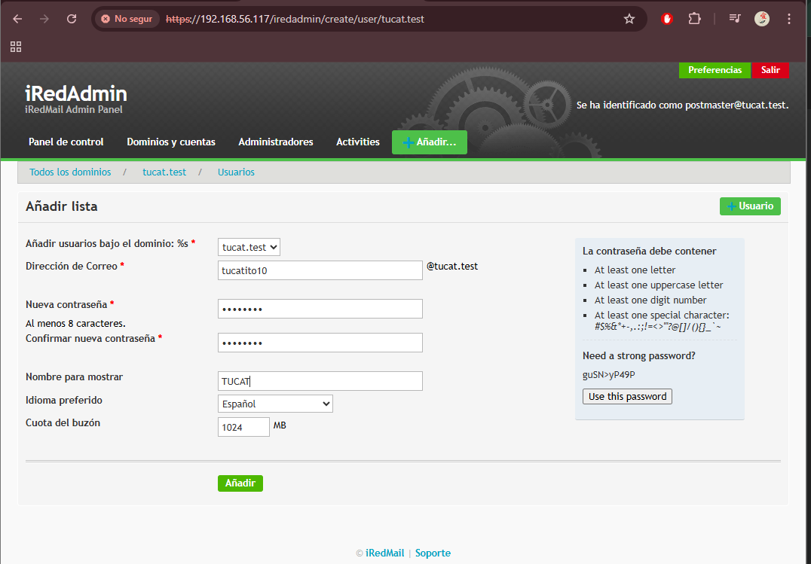


Desde el menú de usuarios del dominio.

**:** Creación y perfil del usuario.

***

## 6. Webmail y correos internos

### 6.1 Acceso a Roundcube

Se accede al webmail desde:

    https://192.168.56.117/mail

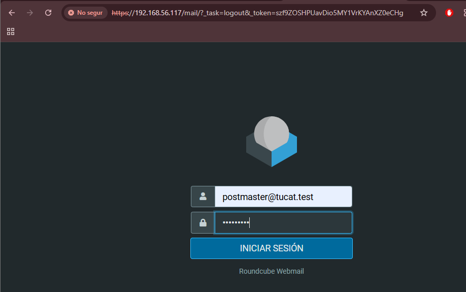


Al iniciar sesión con el administrador se reciben correos automáticos del sistema.

**:** Bandeja de entrada inicial en Roundcube.

***

### 6.2 Envío de correos internos

Se envía un correo desde `postmaster@tucat.test` a `tucatito10@tucat.test`.

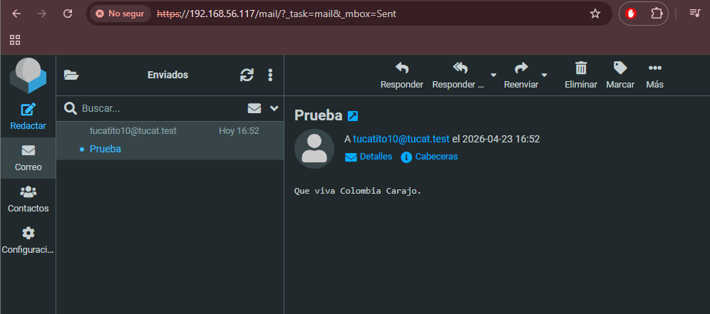

El mensaje se entrega correctamente.

**:** Envío y confirmación del correo interno.

***

## 7. Envío de correos a Gmail (correo brossa)

Se envía un correo desde el servidor a una cuenta de Gmail externa.

El mensaje llega correctamente pero es clasificado como correo no deseado.

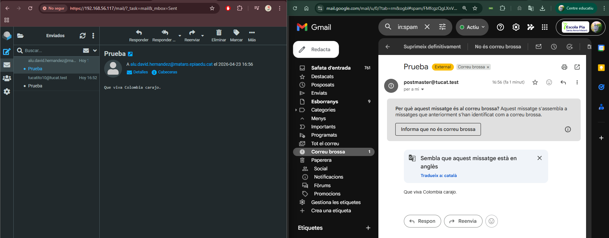


**:** Correo recibido en la carpeta de spam de Gmail.

### Motivo

Esto ocurre porque:

*   El dominio es `.test`
*   No existen registros DNS reales (SPF, DKIM, DMARC)
*   La IP no tiene reputación pública

***

## 8. Segundo dominio y pruebas entre dominios

### 8.1 Creación de segundo dominio

Se crea el dominio:

    alumno10.test

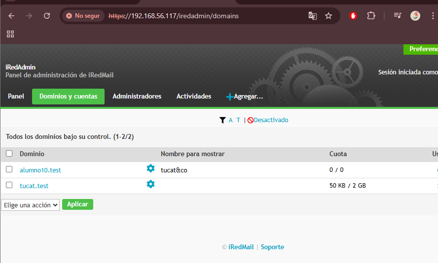

Y el usuario:

    alumnito10@alumno10.test

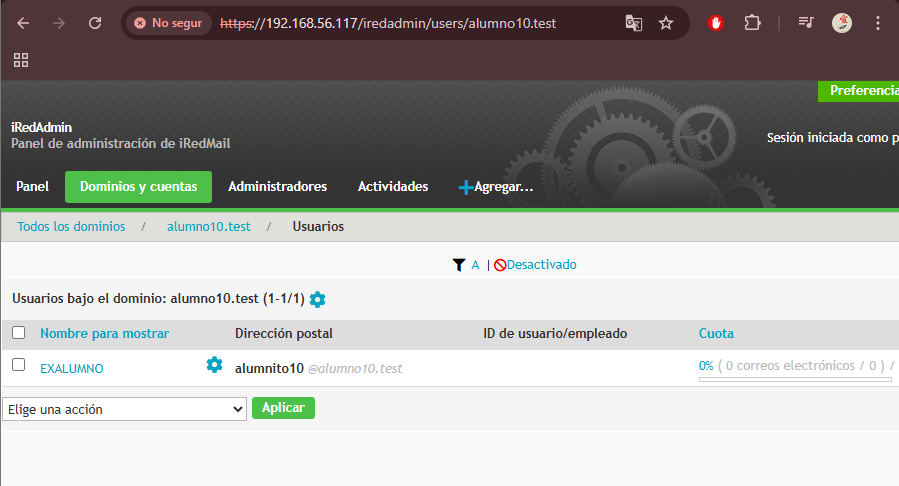

**:** Segundo dominio y usuario creados.

***

### 8.2 Comunicación entre dominios

Se comprueba el envío de correos entre ambos dominios y funciona correctamente.

***

## 9. Revisión final de logs

Se revisan nuevamente los logs de administración, donde queda registrado todo el proceso de la práctica.

**:** Logs finales del sistema.

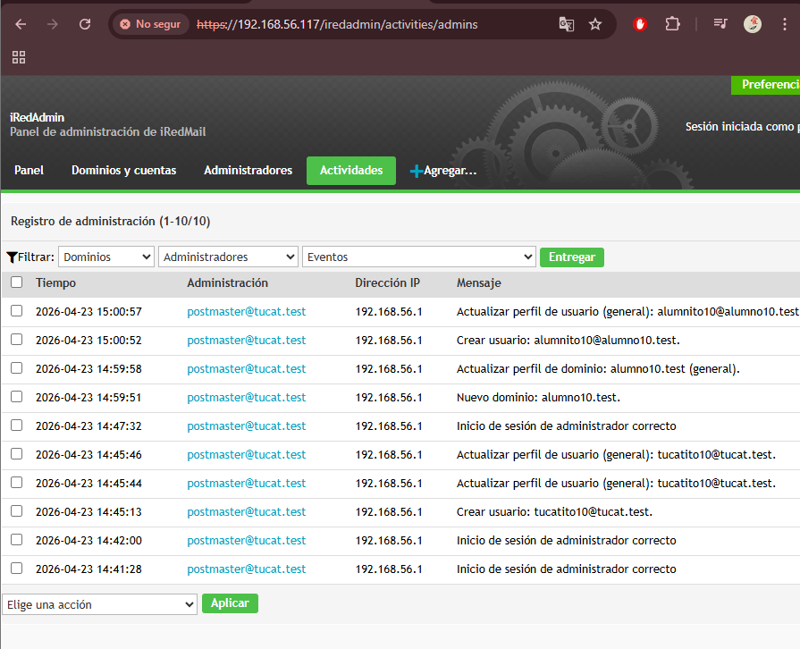


***

## 10. Conclusión

El servidor de correo ha sido configurado correctamente.  
Se han creado dominios y usuarios, se han probado comunicaciones internas y externas y se ha analizado el comportamiento del sistema frente a servicios externos.  
Además, se han revisado los logs, confirmando que todas las acciones quedan correctamente registradas.


