# P01 – MEMORIA TÉCNICA DEL PROYECTO

## Proyecto Intermodular SMX2

### Propuesta tecnológica para **FoodLogístic S.A.**

**Autores:**  
David Santiago  
Santiago Moreno

***

## 1. Introducción

El presente documento recoge la **memoria técnica completa del proyecto FoodLogístic S.A.**, desarrollado dentro del módulo de **Proyecto Intermodular** del ciclo formativo de grado medio **Sistemas Microinformáticos y Redes (SMX2)**.

El proyecto se plantea como un **caso real de empresa**, en el que se debe analizar, diseñar, implementar y documentar una solución tecnológica integral que permita a la empresa modernizar su infraestructura IT, mejorar su seguridad, cumplir la normativa legal vigente y desarrollar una presencia web corporativa profesional.

Esta memoria tiene como finalidad:

*   Documentar todas las **tareas y productos** desarrollados
*   Explicar **qué se tenía que hacer y qué se ha hecho**
*   Justificar las **decisiones técnicas tomadas**
*   Reflejar los **aprendizajes adquiridos** durante el proyecto

***

## 2. Análisis de necesidades del cliente

### 2.1 Contexto inicial

FoodLogístic S.A. es una empresa del sector de la **logística alimentaria**, que gestiona información sensible relacionada con:

*   Clientes
*   Trabajadores
*   Operaciones internas
*   Recursos humanos

Antes del inicio del proyecto, la empresa presentaba las siguientes carencias:

*   Ausencia de infraestructura informática centralizada
*   Riesgos de acceso no controlado a los datos
*   Falta de documentación técnica
*   Presencia web inexistente o incompleta
*   Cumplimiento legal no garantizado (RGPD, LOPDGDD)

***

### 2.2 Necesidades detectadas

| Área      | Necesidad                       |
| --------- | ------------------------------- |
| Usuarios  | Gestión centralizada de cuentas |
| Datos     | Acceso seguro y segmentado      |
| Impresión | Sistema compartido y eficiente  |
| Seguridad | Protección de datos personales  |
| Formación | Concienciación de empleados     |
| Web       | Imagen corporativa profesional  |
| Gestión   | Planificación y presupuesto     |

***

## 3. Relación completa de tareas y productos del proyecto

La siguiente tabla muestra **todas las tareas (T) y productos (P)** desarrollados, garantizando la trazabilidad académica y técnica del Proyecto Intermodular.

| Código | Tipo     | Descripción                                     | Bloque          |
| ------ | -------- | ----------------------------------------------- | --------------- |
| T01    | Tarea    | Active Directory y gestión de usuarios          | Infraestructura |
| T02    | Tarea    | Desarrollo web corporativa individual           | Web             |
| T03    | Tarea    | Servidor de ficheros y permisos NTFS            | Infraestructura |
| T04    | Tarea    | Servidor de impresión y GPO                     | Infraestructura |
| T05    | Tarea    | Vídeo formativo LOPD para empleados             | Seguridad       |
| T06    | Tarea    | Cumplimiento legal web (RGPD, LOPDGDD, LSSI-CE) | Seguridad       |
| T07    | Tarea    | Presentación sobre migración a la nube          | Cloud           |
| T08    | Tarea    | Comparativa de propuestas web                   | Web             |
| T09    | Tarea    | Planificación del proyecto (Gantt)              | Gestión         |
| T10    | Tarea    | Integrada en el desarrollo global del proyecto  | General         |
| T11    | Tarea    | Integrada en el desarrollo global del proyecto  | General         |
| T12    | Tarea    | Presupuesto y viabilidad del proyecto           | Gestión         |
| P01    | Producto | Memoria técnica del proyecto                    | Documentación   |
| P02    | Producto | Web corporativa final publicada                 | Web             |

***

## 4. Infraestructura técnica (T01, T03, T04)

### 4.1 Objetivo de la infraestructura

Diseñar una infraestructura **centralizada, segura y escalable**, basada en **Windows Server**, que simule un entorno empresarial real y permita una gestión eficiente de usuarios y recursos.

***

### 4.2 Active Directory – Gestión de usuarios (T01)

**Qué se tenía que hacer**

*   Centralizar usuarios y equipos
*   Organizar la empresa por departamentos

**Cómo se realizó**

*   Instalación de Windows Server
*   Promoción a controlador de dominio
*   Creación de Unidades Organizativas (OU)
*   Alta de usuarios por perfiles

**Qué se aprendió**

*   Diseño lógico de dominios
*   Importancia de una buena estructura de AD
*   Gestión realista de usuarios empresariales

***

### 4.3 Servidor de ficheros (T03)

**Objetivo**  
Garantizar un acceso seguro y organizado a los datos corporativos.

**Implementación**

*   Carpetas por departamento
*   Permisos NTFS diferenciados
*   Acceso según rol del usuario

| Departamento   | Acceso              |
| -------------- | ------------------- |
| Administración | Lectura y escritura |
| Logística      | Lectura y escritura |
| RRHH           | Acceso restringido  |

**Aprendizajes**

*   Gestión avanzada de permisos
*   Importancia de la segmentación de datos

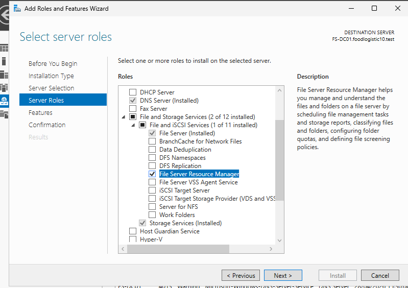 

 

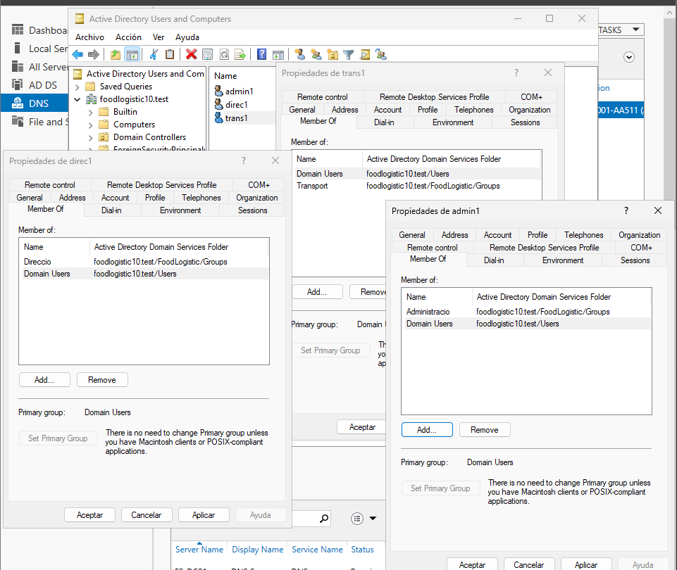 

 

***

### 4.4 Servidor de impresión (T04)

**Qué se hizo**

*   Instalación del rol de impresión
*   Printer pooling
*   Distribución de impresoras mediante GPO

**Beneficios**

*   Optimización de recursos
*   Gestión centralizada
*   Mayor eficiencia operativa

***

## 5. Web corporativa (T02, T08 y P02)

### 5.1 Propuesta web individual (T02)

Cada miembro del grupo desarrolló una **web corporativa individual**, publicada en GitHub Pages.

*   Web:  
    <https://aludavidsantiago.github.io/foodlogistic-web/>
*   Repositorio:  
    <https://github.com/aluDavidSantiago/foodlogistic-web>

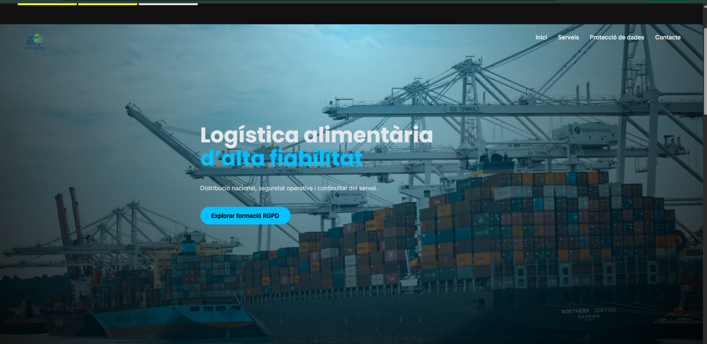 

**Aprendizajes**

*   Estructuración HTML
*   Diseño responsivo
*   Publicación web real

***

### 5.2 Comparativa de propuestas web (T08)

Se compararon dos propuestas (Web A y Web B) según:

*   Diseño visual
*   Contenido informativo
*   Experiencia de usuario
*   Imagen profesional
*   Aspectos legales

**Decisión final**
Se optó por una **web combinada**, tomando:

*   Diseño visual e interactividad de la Web A
*   Claridad informativa y estructura de la Web B

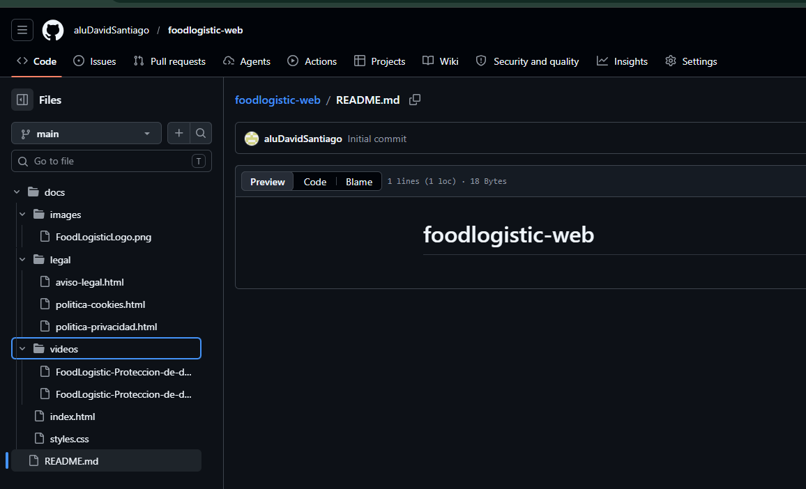 

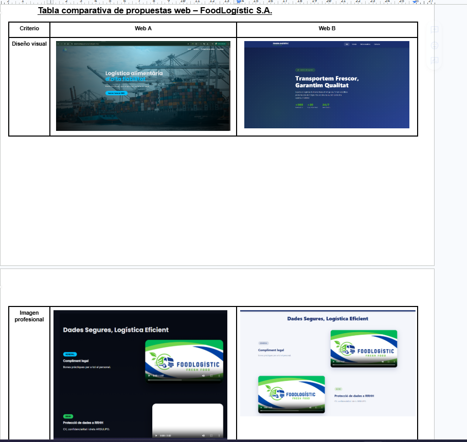 

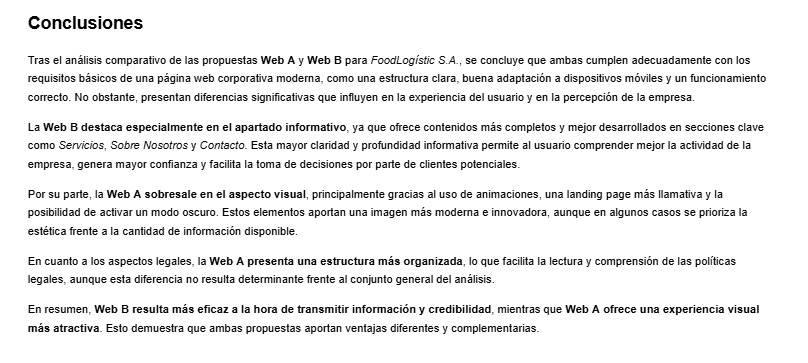 

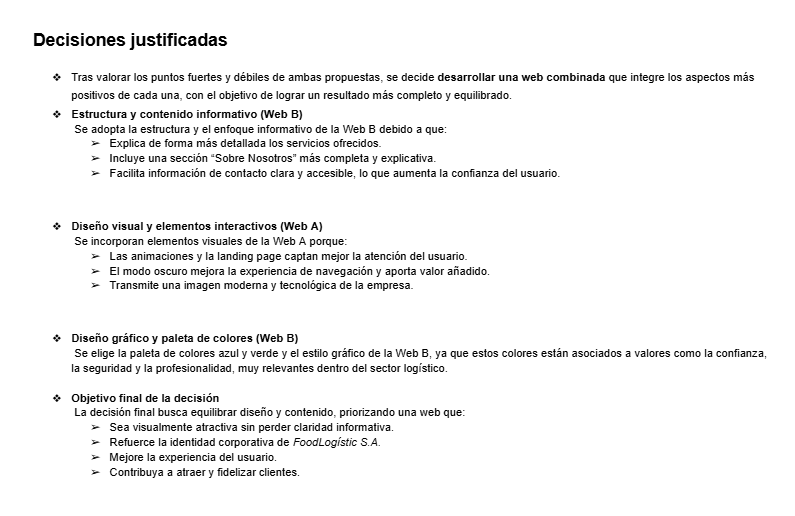 

***

### 5.3 Web final del proyecto – P02

**Web oficial**
<https://classessmx2n.github.io/web-projecte7-aluDavidSantiago/>

**Repositorio**
<https://github.com/classesSMX2n/web-projecte7-aluDavidSantiago>

Incluye:

*   Página principal
*   Secciones corporativas
*   Aviso legal
*   Política de privacidad
*   Política de cookies
*   Vídeos formativos RGPD

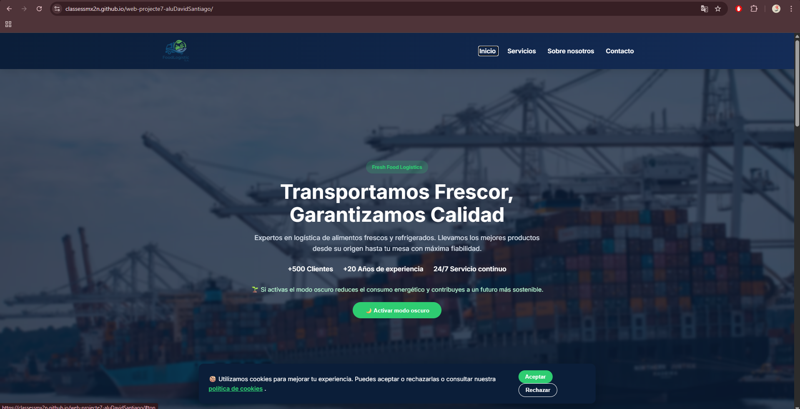 

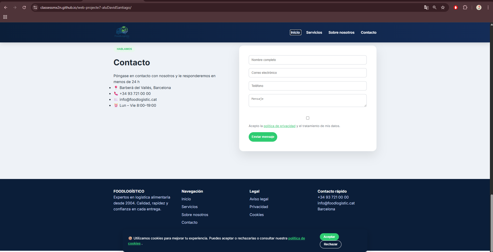 

***

## 6. Seguridad, LOPD y cumplimiento legal (T05 y T06)

### 6.1 Vídeo formativo LOPD (T05)

Se creó un **vídeo formativo dirigido a empleados**, en el que se explica:

*   Tratamiento correcto de datos personales
*   Riesgos de malas prácticas
*   Responsabilidades legales
*   Importancia de la confidencialidad

El vídeo fue integrado en la web corporativa.

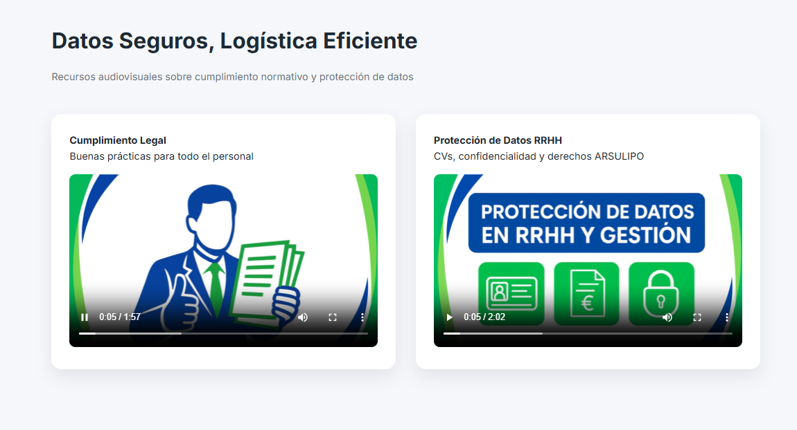 

***

### 6.2 Cumplimiento legal web (T06)

Se desarrollaron e integraron los documentos legales obligatorios:

*   Aviso legal
*   Política de privacidad
*   Política de cookies

Cumpliendo con:

*   RGPD
*   LOPDGDD
*   LSSI-CE

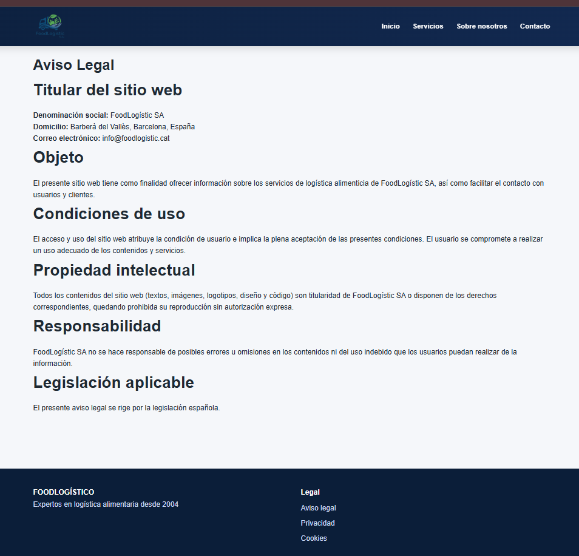 

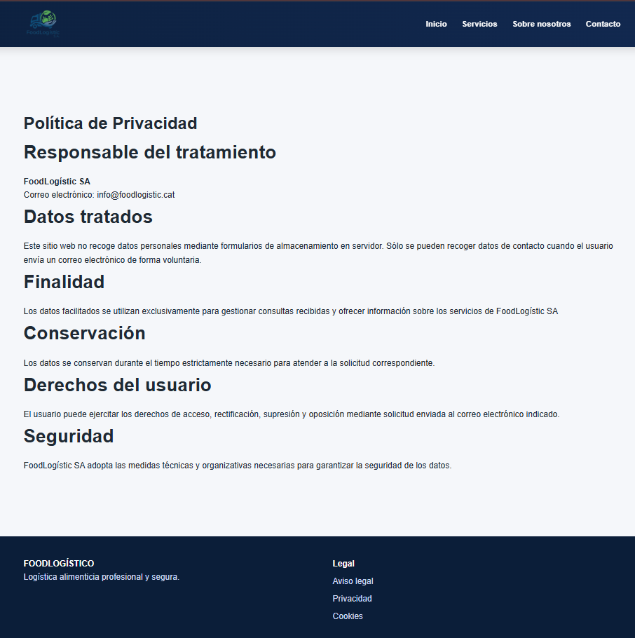 

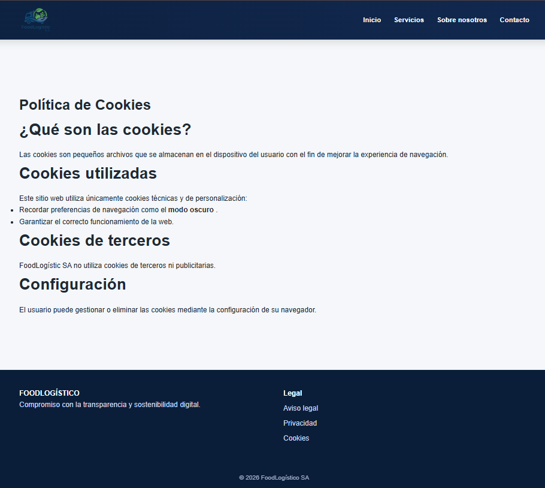 

***

## 7. Servicios en la nube – Migración (T07)

Se elaboró una **presentación técnica** sobre la **migración del correo corporativo a la nube**, analizando:

*   Ventajas del cloud
*   Seguridad y disponibilidad
*   Comparación con sistemas locales
*   Viabilidad técnica y económica

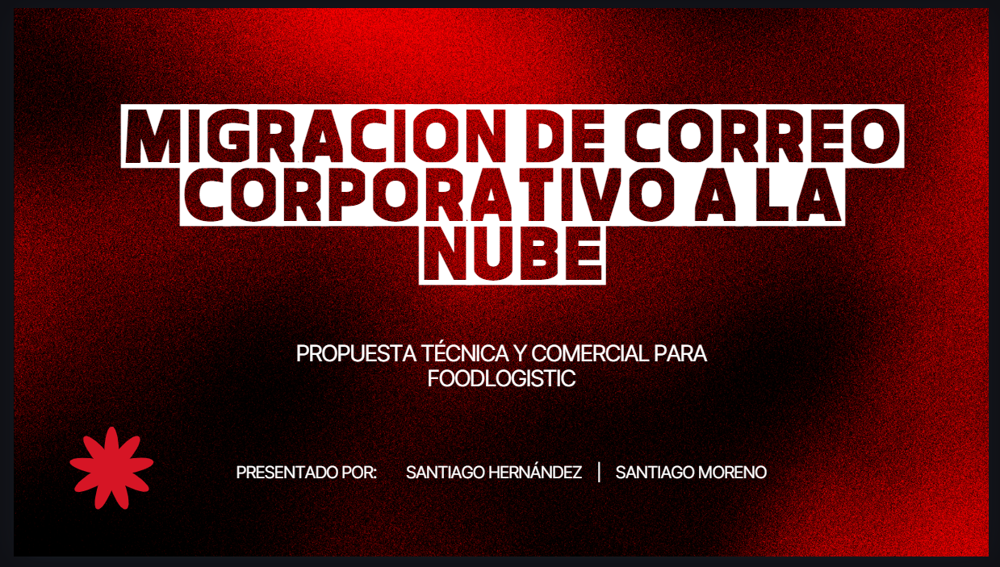 

***

## 8. Planificación del proyecto (T09)

Se diseñó un **diagrama de Gantt** que define:

*   Fases del proyecto
*   Dependencias
*   Duración de tareas
*   Orden lógico de ejecución

Esto permitió una correcta organización del trabajo.

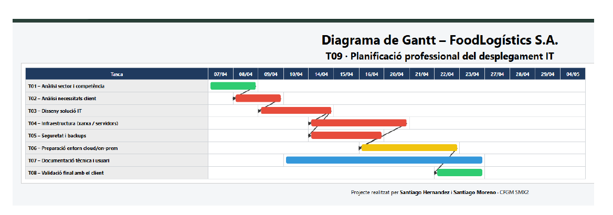 

***

## 9. Presupuesto y viabilidad (T10)

Se realizó un estudio de **presupuesto** teniendo en cuenta:

*   Costes de infraestructura
*   Recursos humanos
*   Escenario realista para una PYME

**Conclusión**
La solución es **viable económicamente** gracias al uso de software estándar y servicios en la nube.

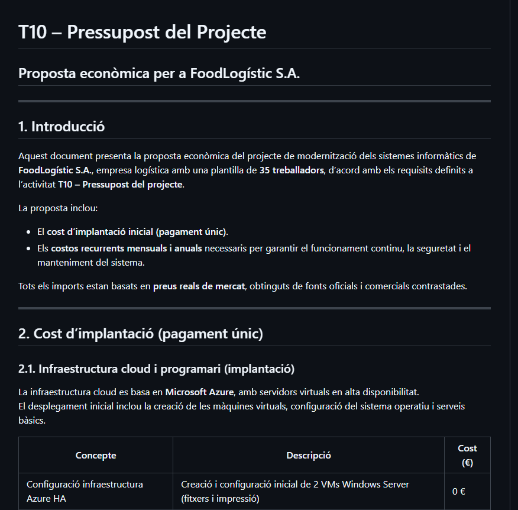 

***

## 10. Reparto de trabajo y aportación individual

El proyecto se desarrolló de forma **colaborativa**, simulando un entorno profesional.

Ambos integrantes participaron en:

*   Análisis del cliente
*   Toma de decisiones técnicas
*   Infraestructura
*   Web
*   Seguridad
*   Documentación
*   Presentaciones

***

## 11. Presupuesto y viabilidad (T11)

Perfecto 👍, aquí te dejo **las versiones cortas y bien ajustadas** de los dos apartados que faltaban, listas para **copiar y pegar** en la memoria **sin que quede larga ni pesada**.

***

## 12. Presupuesto, viabilidad y estructura empresarial (T12)

En la tarea **T12: “TechLaunch Mataró: De la Idea a la Startup”** se analizó la **viabilidad empresarial y jurídica** de una empresa de servicios tecnológicos situada en Mataró.

Se compararon distintas formas jurídicas atendiendo a:

*   Capital mínimo
*   Responsabilidad frente a terceros
*   Agilidad en la toma de decisiones

La opción de **startup bajo la Ley 28/2022** se consideró la más adecuada, ya que ofrece ventajas fiscales, mayor protección del código y mejores condiciones para la inversión. También se simuló el proceso de constitución de la empresa, incluyendo trámites como el certificado negativo de nombre, la redacción de estatutos con cláusulas de propiedad intelectual y el alta en el entorno del **TecnoCampus Mataró**.

**Aprendizaje:**  
Se comprendió la importancia de una estructura jurídica sólida para garantizar la viabilidad económica y legal de un proyecto tecnológico.

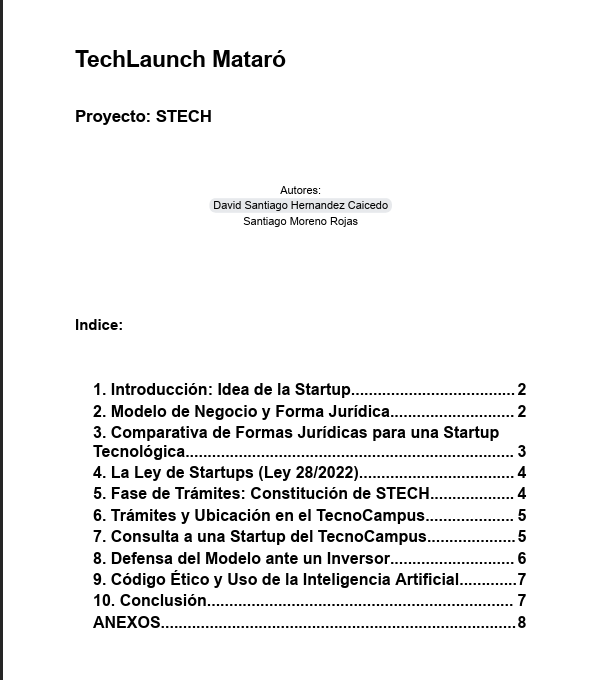 

***

## 13 Implantación de una intranet empresarial con WordPress (T11)

Como parte complementaria del proyecto se realizó la **implantación de una intranet empresarial** mediante **WordPress**, con el objetivo de simular un entorno web interno de trabajo corporativo.

La intranet se desarrolló en un entorno local utilizando **Local WP**, y se amplió mediante el plugin **WP File Manager** para la gestión documental. Se creó una estructura de carpetas que simula la organización interna de una empresa y se configuraron distintos usuarios con roles diferenciados (administrador, director, trabajador y externo).

Se realizaron pruebas de acceso para comprobar que cada usuario tenía los permisos adecuados y que el sistema funcionaba correctamente sin comprometer la seguridad.

**Aprendizaje:**  
Esta tarea permitió aplicar conocimientos de servicios web, gestión de usuarios y control de accesos en un entorno empresarial simulado.

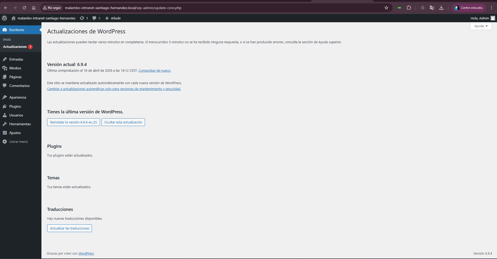 

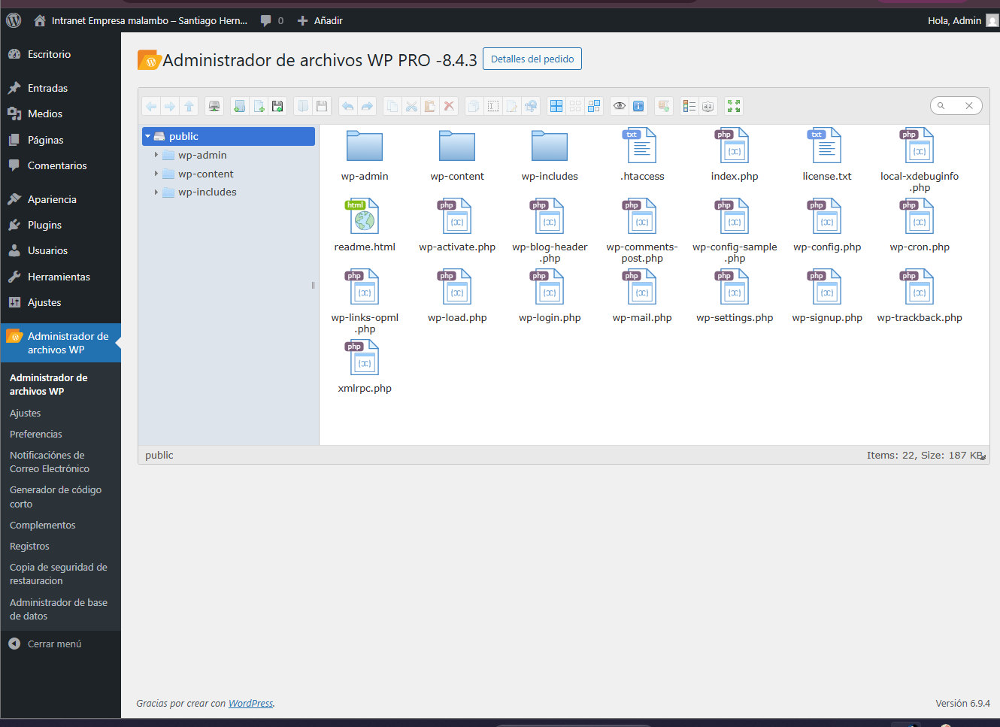 

## 14. Aprendizajes globales adquiridos

### Técnicos

*   Windows Server y Active Directory
*   Permisos NTFS
*   Servicios de impresión
*   Desarrollo web
*   Git y GitHub

### Organizativos

*   Planificación de proyectos
*   Trabajo en equipo
*   Gestión del tiempo

### Profesionales

*   Documentación técnica
*   Visión empresarial
*   Cumplimiento legal
*   Defensa de propuestas técnicas

***
