# MEMÒRIA DE SOSTENIBILITAT

**Projecte:** Web de FoodLogístic\
**Mòdul:** Sostenibilitat\
**Curs:** CFGM\
**Data:** 27-04-2026\
**Alumne/a:** Santiago Hernandez

***

## 1. URL de l’app

<https://aludavidsantiago.github.io/foodlogistic-web/>

***

## 2. Memòria de Sostenibilitat

### a) Recursos utilitzats al projecte

**Extensió de les imatges utilitzades**

*   `.png`: logotip corporatiu.
*   `.avif`: imatge de fons obtinguda d’Unsplash (format modern optimitzat).
*   `.mp4`: dos vídeos formatius a la secció de protecció de dades.

**Mida de les imatges i recursos**

*   Logotip PNG: 193 KB.
*   Vídeo formatiu 1: 8 MB.
*   Vídeo formatiu 2: 10 MB.
*   Pes total de la pàgina (EcoGrader): 19,78 MB.

**Fonts utilitzades**

*   Inter
*   Poppins

**Són fonts de sistema?**\
No.\
Són fonts externes carregades des de Google Fonts mitjançant `preconnect`, reduint la latència i millorant el rendiment.

**Mode fosc**\
Sí.\
La web és fosca per defecte, fet que millora la llegibilitat en entorns amb poca llum i redueix el consum energètic en pantalles OLED.

***

### b) Eines per mesurar l’impacte

## Aspecte Ambiental · Suportable

### 1. Website Carbon Calculator

**Resultats obtinguts**

*   Emissions per visita: **2,06 grams de CO₂**
*   Classificació de carboni: **F**
*   Més contaminant que el **96 %** de les webs analitzades
*   Ús d’energia estàndard (no renovable)

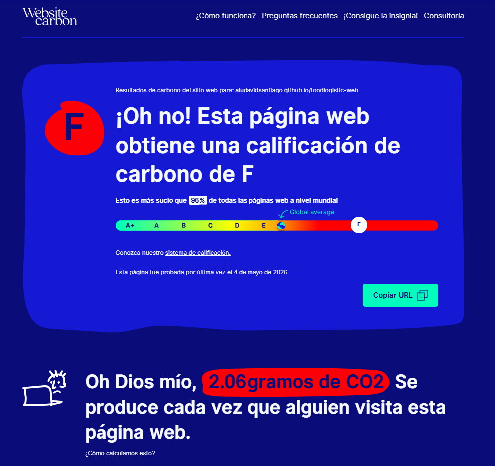 
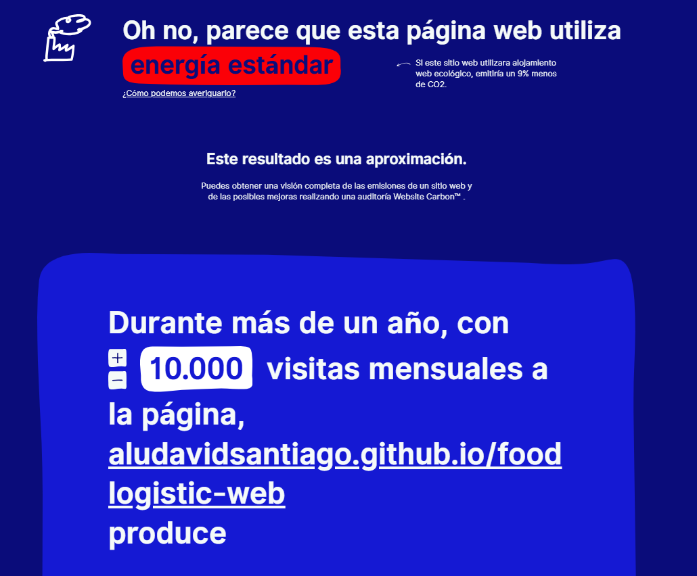 
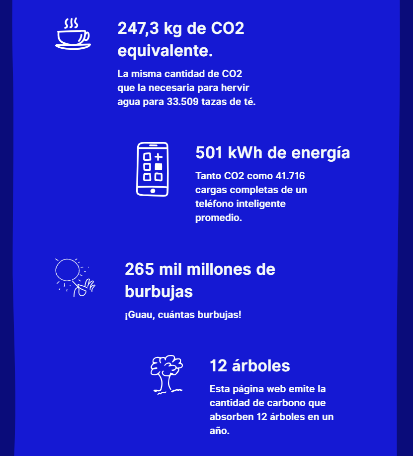 
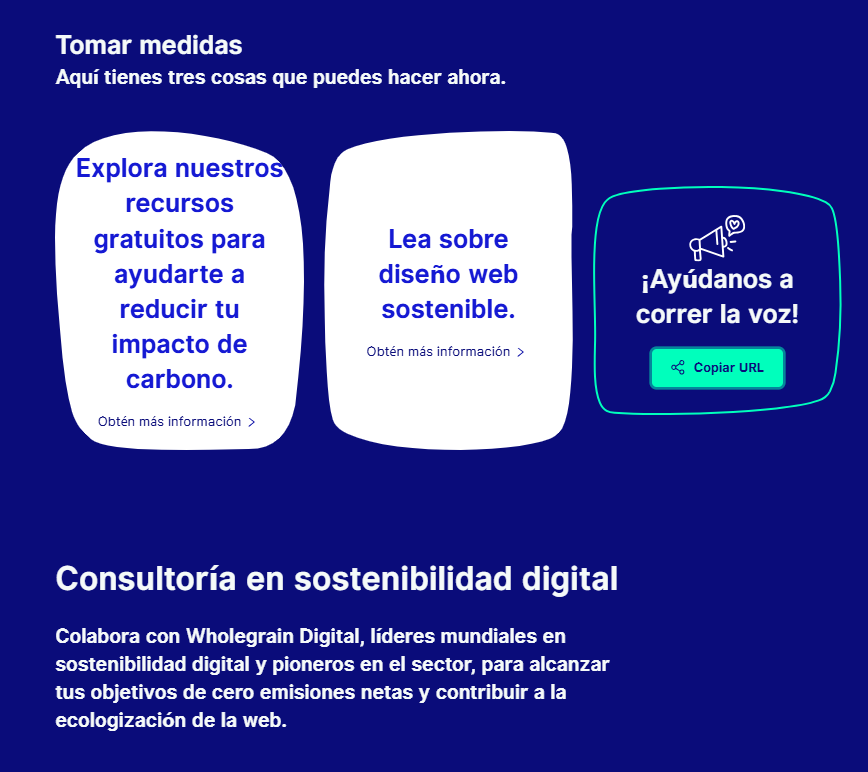 

**Projecció anual**\
Amb 10.000 visites mensuals durant un any:

*   247,3 kg de CO₂ equivalents
*   501 kWh d’energia consumida
*   Impacte equivalent a l’absorció anual de 12 arbres

**Comentari**\
Tot i que les emissions per visita són moderades, el pes dels recursos multimèdia (especialment els vídeos) incrementa l’impacte ambiental anual. L’ús de hosting amb energia verda i l’optimització dels vídeos reduiria significativament aquestes emissions.

***

### 2. EcoGrader

**Resultats obtinguts**

*   Puntuació EcoGrader: **40 / 100**
*   Emissions per càrrega: **7,71 g de CO₂**
*   Classificació digital: **E**
*   Pitjor que el **93 %** de les URLs analitzades

**Desglossament d’emissions**

*   Media (vídeos): 19,22 MB – 7,4898 g CO₂e
*   Imatges: 423 KB – 0,1649 g CO₂e
*   Scripts: 67,79 KB – 0,0262 g CO₂e
*   HTML/CSS: 6,68 KB – 0,0023 g CO₂e

**Comentari**\
El contingut multimèdia és el principal factor d’impacte ambiental. El codi HTML i CSS és molt lleuger, indicant una base tècnica correcta amb marge de millora en la gestió dels vídeos.

***

## Aspecte Social · Equitatiu (Accessibilitat – A11Y)

L’accessibilitat s’ha abordat com a **disseny universal**, garantint l’ús per persones amb diversitat funcional, connexions lentes i diferents contextos d’ús.

***

### 3. Lighthouse (Chrome DevTools)

**Eina utilitzada:** Lighthouse – mode Desktop i Mobile.

**Desktop**

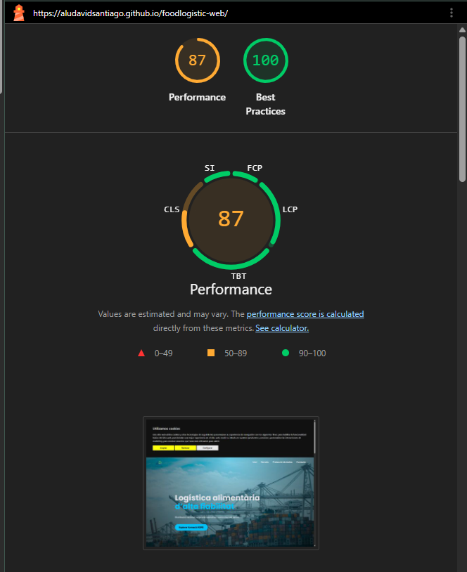 
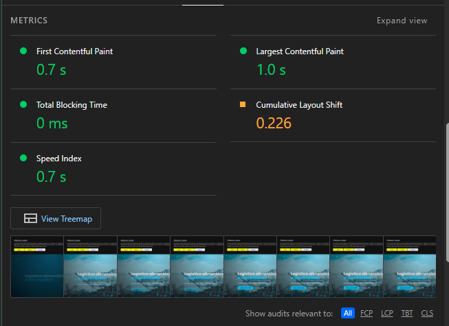 
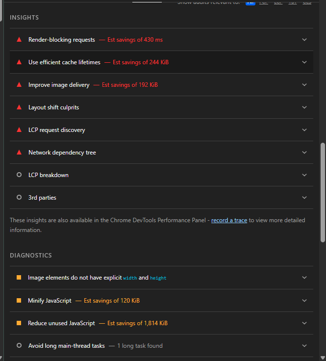 
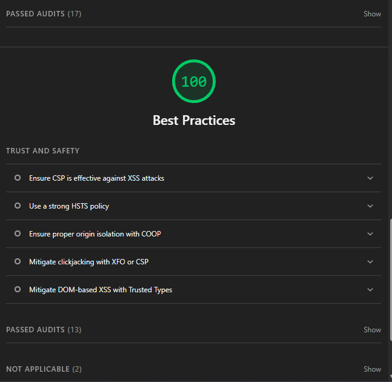 

**Mobile**

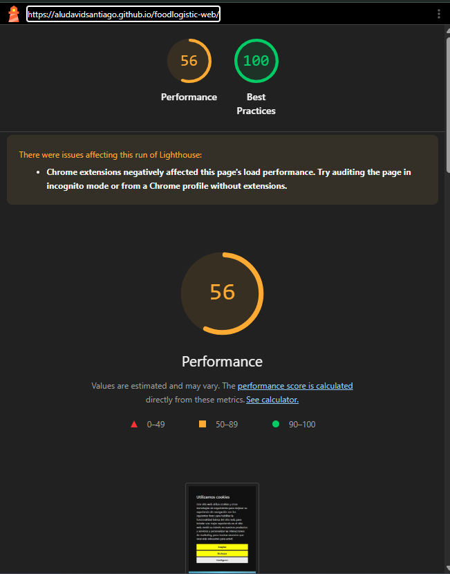 
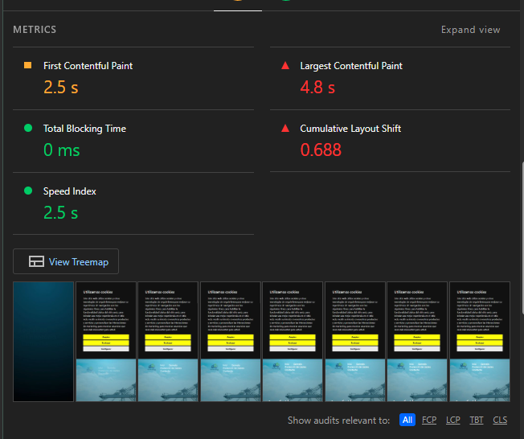 
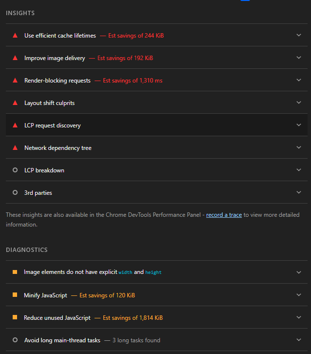 
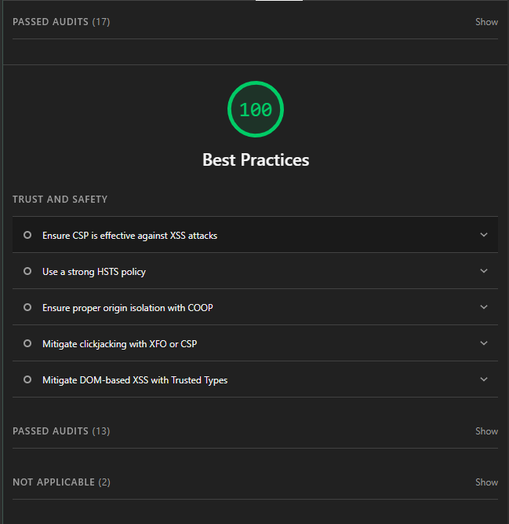 

**Resultats obtinguts**

*   Performance: **87 / 100**
*   Best Practices: **100 / 100**

**Anàlisi**\
La puntuació de performance és bona. Les millores detectades estan relacionades amb el pes de recursos multimèdia, imatges sense dimensions explícites i optimització de JavaScript. Best Practices assoleix puntuació màxima.

***

## Què cal fer: Criteris clars de millora aplicats

### 1. Contrast i Color

Inicialment es va revisar el contrast de tots els textos per evitar combinacions poc llegibles.\
La paleta fosca amb text clar compleix el contrast mínim **4.5:1**, millorant la llegibilitat i reduint la fatiga visual.

***

### 2. Alternatives Textuals (Alt Text)

**Problema detectat inicialment**\
Algunes imatges no tenien una descripció clara per a lectors de pantalla.

**Abans**

**Després**

Això millora l’accessibilitat i el posicionament SEO.

***

### 3. Navegació per Teclat (Focus)

S’ha comprovat la navegació utilitzant només la tecla **Tab**, confirmant que tots els elements interactius són accessibles i que el **focus visual és clarament visible**, especialment al menú (exemple: “Serveis”).

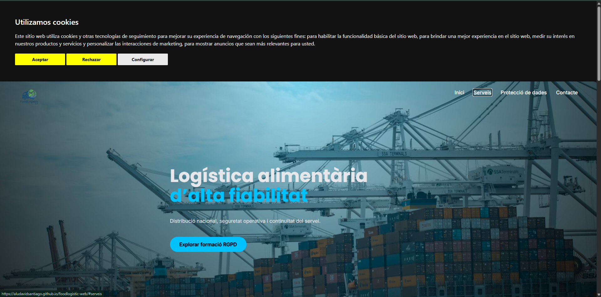 

***

## Checklist final

*   Contrast mínim 4.5:1 complert
*   Imatges amb atribut `alt`
*   Navegació amb tecla Tab funcional
*   Focus visible
*   Lighthouse superat (Performance i Best Practices)

***

## Conclusions sobre la sostenibilitat

### Impacte Ambiental

El codi semàntic i els recursos lleugers redueixen el consum de CPU i GPU. El principal punt de millora és l’optimització del contingut multimèdia.

### Impacte Social

L’accessibilitat elimina la bretxa digital, garantint l’accés universal a la informació independentment del context o capacitat de l’usuari.

### Impacte Econòmic

Una web accessible millora el SEO, evita sancions legals i amplia el mercat potencial, assegurant la viabilitat del projecte.

***

## Aspecte Econòmic · Viable

### El valor de l’eficiència

*   Codi lleuger = menys consum de CPU i memòria = menor cost en serveis cloud.
*   Compatibilitat amb dispositius antics allarga el cicle de vida del hardware.
*   Codi net i documentat redueix el deute tècnic i les hores de manteniment.

### Monetització sostenible triada

*   **Model principal:** Subscripció (SaaS) per a serveis formatius i contingut especialitzat.
*   **Model complementari:** Freemium/Premium per assegurar equitat social.
*   **Publicitat invasiva:** descartada pel seu alt impacte ambiental i mala experiència d’usuari.

### Reflexió final

El codi més barat de mantenir, el més fàcil de monetitzar i el que menys contamina és el mateix:\
un codi senzill, accessible, eficient i ben optimitzat.

