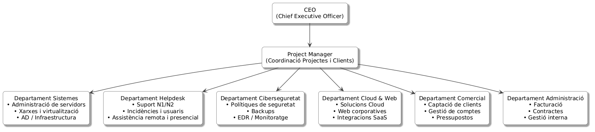

## Organigrama professional de la nostra empresa

Aquest és l’organigrama corporatiu que mostra els rols clau i l’estructura professional que utilitzem per donar servei a FoodLogístic S.A.




### Codi PlantUML utilitzat

```
@startuml
skinparam style strictuml
skinparam defaultTextAlignment center

' Colors corporatius més sobris i professionals
skinparam rectangle {
    BackgroundColor #f9f9f9
    BorderColor #2b2b2b
    RoundCorner 12
    Shadowing true
}

skinparam arrow {
    Color #444444
    Thickness 1.2
}

' --- ROLS ---
rectangle "CEO\n(Chief Executive Officer)" as CEO

rectangle "Project Manager\n(Coordinació Projectes i Clients)" as PM

rectangle "Departament Sistemes\n• Administració de servidors\n• Xarxes i virtualització\n• AD / Infraestructura" as SYS

rectangle "Departament Helpdesk\n• Suport N1/N2\n• Incidències i usuaris\n• Assistència remota i presencial" as HD

rectangle "Departament Ciberseguretat\n• Polítiques de seguretat\n• Backups\n• EDR / Monitoratge" as SEC

rectangle "Departament Cloud & Web\n• Solucions Cloud\n• Web corporatives\n• Integracions SaaS" as CLOUD

rectangle "Departament Comercial\n• Captació de clients\n• Gestió de comptes\n• Pressupostos" as COM

rectangle "Departament Administració\n• Facturació\n• Contractes\n• Gestió interna" as ADM

' --- ESTRUCTURA ---
CEO --> PM
PM --> SYS
PM --> HD
PM --> SEC
PM --> CLOUD
PM --> COM
PM --> ADM
@enduml
```
