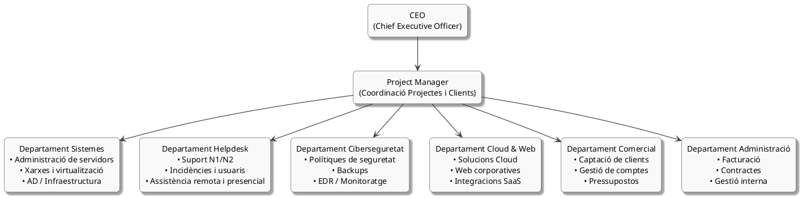

# **Tasca 01 – Anàlisi del Sector, Competència i Organització Interna**

## 1. Competència del sector IT a Mataró

A continuació es presenten tres empreses reals de serveis informàtics ubicades a Mataró i rodalies. Aquest estudi de competència permet contextualitzar el sector i identificar els models de servei predominants.

| Empresa             | Localitat | Mida         | Serveis principals                                                                                                         |
| ------------------- | --------- | ------------ | -------------------------------------------------------------------------------------------------------------------------- |
| **Digitalnet**      | Mataró    | PIME         | Manteniment informàtic per a empreses, suport tècnic, instal·lació i gestió de xarxes, solucions cloud i consultoria IT    |
| **Tècnic Mataró**   | Mataró    | Microempresa | Manteniment informàtic, reparació d’equips, venda de maquinari, còpies de seguretat i instal·lació de sistemes             |
| **Market Software** | Mataró    | PIME         | Manteniment informàtic, desenvolupament de software de gestió (ERP), serveis cloud, venda d’equips i solucions d’impressió |

***

## 2. Organigrama professional de la nostra empresa

L’organigrama següent representa l’estructura interna de la nostra empresa tecnològica. Aquest model organitzatiu està dissenyat per garantir una gestió eficient de projectes, mantenir una alta disponibilitat dels serveis i donar resposta a les necessitats tècniques de FoodLogístic S.A.

./IMG/organigrama.png

### Codi PlantUML utilitzat

***

## 3. Radiografia dels departaments de la nostra empresa

La nostra empresa disposa d’una estructura organitzativa orientada a oferir solucions integrals en l’àmbit dels sistemes informàtics, el suport tècnic i la ciberseguretat. Els departaments principals són els següents:

### 3.1 Departament de Sistemes

Gestiona i manté la infraestructura crítica: servidors, virtualització, xarxes, Active Directory i polítiques d’alta disponibilitat. Garanteix la continuïtat operativa i la fiabilitat dels equips i serveis d’empresa.

### 3.2 Departament Helpdesk

Proporciona suport tècnic N1 i N2, resolució d’incidències, assistència remota i presencial, i gestió d’usuaris. És el primer punt de contacte tècnic per a clients i personal.

### 3.3 Departament de Ciberseguretat

Responsable de la implementació de polítiques de seguretat, gestió de còpies de seguretat, monitoratge d’amenaces, eines EDR i compliment normatiu. Vetlla per la protecció de dades i la prevenció d’incidents.

### 3.4 Departament Cloud i Web

Especialitzat en solucions al núvol, administració de serveis SaaS, implantació de Microsoft 365 o Google Workspace i desenvolupament de webs corporatives. Dona suport a la transformació digital dels clients.

### 3.5 Departament Comercial

S’encarrega de la relació amb clients, elaboració de propostes tècniques i econòmiques, captació de nous comptes i seguiment de projectes.

### 3.6 Departament d’Administració

Gestiona processos de facturació, contractació, compres, documentació legal i tasques internes de coordinació administrativa.

***

## 4. Estratègia i Proposta de Valor

La nostra empresa segueix una estratègia orientada a la qualitat del servei, la proximitat i la seguretat tecnològica. Els principals pilars són:

### 4.1 Proximitat i temps de resposta

La presència local a Mataró ens permet oferir intervencions ràpides i suport immediat, reduint els temps d’inactivitat dels clients.

### 4.2 Especialització en infraestructures crítiques

Disposem d’un equip amb experiència en sistemes d’alta disponibilitat, entorns virtualitzats, servidors Windows i solucions cloud.

### 4.3 Servei d’atenció 24/7

Per garantir la continuïtat del negoci, especialment en empreses com FoodLogístic S.A., oferim assistència permanent per a incidències crítiques.

### 4.4 Transparència operativa

Els clients reben informes periòdics amb totes les accions, millores i resultats de monitoratge.

### 4.5 Manteniment preventiu

Realitzem tasques constants de supervisió i prevenció per reduir riscos, incidències i aturades inesperades.

***

## 5. Recursos humans necessaris per donar servei a FoodLogístic S.A.

Per assegurar una implantació correcta i un suport continu, es requereix el següent equip professional:

### 5.1 Tècnic de Sistemes (Nivell 2)

Especialista en servidors Windows, Active Directory, xarxes, virtualització i alta disponibilitat.

### 5.2 Tècnic Helpdesk (Nivell 1)

Responsable de la resolució d’incidències diàries, suport a usuaris i tasques de manteniment de primer nivell.

### 5.3 Especialista en solucions Cloud

Perfil encarregat de la implantació i gestió de Microsoft 365, Google Workspace i serveis SaaS.

### 5.4 Tècnic de Ciberseguretat

Professional encarregat de còpies de seguretat, gestió de riscos, eines EDR i compliment normatiu (LOPD).

**Conclusió:**  
Per donar servei a FoodLogístic S.A. amb garanties, seria necessari incorporar un tècnic addicional de suport Helpdesk a fi d’absorbir el volum d’incidències i manteniment previst.

***
