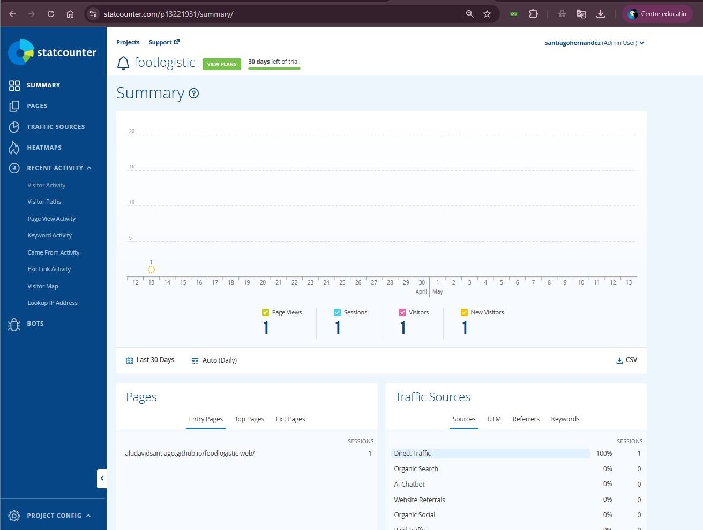
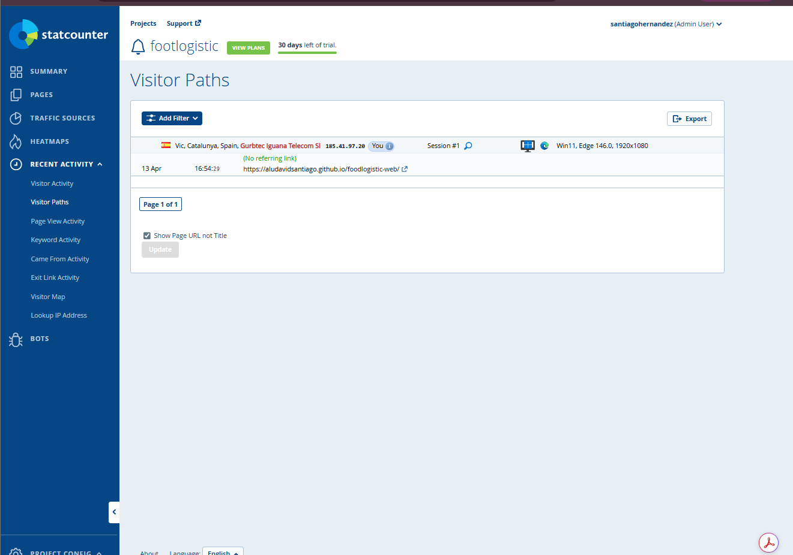
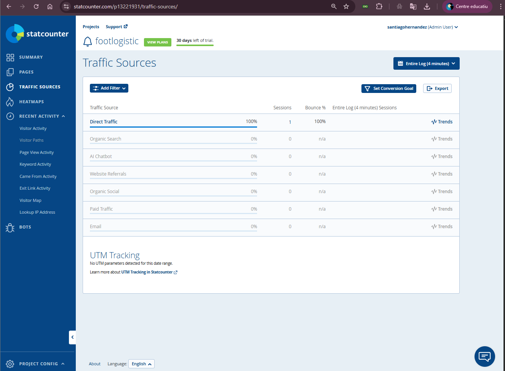

# T02: Proposta de pàgina corporativa (FoodLogístic S.A.)

## 1. Descripció del projecte

Aquesta activitat té com a objectiu crear una proposta funcional de la nova pàgina corporativa de FoodLogístic S.A., utilitzant GitHub Pages com a entorn de desplegament professional.

La web publicada mostra:

*   Disseny modern basat en HTML i CSS
*   Estructura corporativa clara
*   Tipografies Poppins i Inter
*   Navegació interna
*   Seccions funcionals (Inici, Serveis, Empresa, Contacte)
*   Imatges lliures de drets d’ús
*   Integració d’un comptador d’analítica web (StatCounter)

L’objectiu és proporcionar a FoodLogístic S.A. una vista preliminar de com podria ser la seva nova presència digital.

***

## 2. Estructura del repositori

El projecte segueix estrictament l'estructura requerida per GitHub Pages:

    /docs
       ├── index.html
       ├── styles.css
       └── /images
             └── FoodLogisticLogo.png

La carpeta `/docs` és la que GitHub Pages utilitza com a arrel de la web.

***

## 3. Enllaços del projecte

Repositori utilitzat per la publicació:  
<https://github.com/aludavidsantiago/foodlogistic-web>

Pàgina web corporativa publicada amb GitHub Pages:  
<https://aludavidsantiago.github.io/foodlogistic-web/>

***

## 4. Funcionalitats implementades

*   Pàgina corporativa real, funcional i responsive.
*   Capçalera amb imatge de fons i superposició.
*   Menú de navegació amb seccions internes.
*   Efectes visuals de transició (scroll reveal).
*   Secció de serveis definida amb targetes.
*   Secció d’empresa amb imatge relacionada amb el sector logístic.
*   Formulari de contacte amb validació HTML.
*   Utilització d'imatges lliures de drets (Unsplash).
*   Logo corporatiu ubicat a `/docs/images`.
*   Publicació totalment operativa sota URL pública.

***

## 5. Integració d’analítica: StatCounter

S’ha integrat un comptador invisible dins de `index.html` just abans de la tancada `</body>`.

Aquest comptador permet analitzar:

*   Visites rebudes
*   Rutes de navegació
*   Sistemes operatius i navegadors
*   Temps de permanència
*   Fonts de trànsit

StatCounter ha estat instal·lat correctament i ja registra visites reals.

### 5.1 Captures de les mètriques

A continuació s’adjunten captures del panell de StatCounter:

**Summary**

**Recent Activity – Visitor Paths**

**Traffic Analysis**

Aquestes captures demostren que el comptador està actiu i operatiu.

***

## 6. Conclusions

El projecte compleix tots els requisits de l’activitat T02:

*   La web està plenament operativa amb GitHub Pages.
*   El repositori segueix l’estructura exigida amb `/docs`.
*   S’ha desenvolupat i documentat un README complet i detallat.
*   StatCounter està instal·lat, verificat i capturant dades reals.
*   El flux de treball amb commits és correcte i rastrejable.

La proposta elaborada representa una primera versió funcional i presentable de la futura web corporativa de FoodLogístic S.A., amb base tècnica sòlida i preparada per a ser ampliada.
