# T03 – Servidor de Fitxers

**Implementación de un servidor de archivos seguro y controlado**

**Alumno:** Santiago Hernández  
**Nº de lista:** 10  
**Asignatura:** Sistemas Operativos en Red  
**Dominio:** `foodlogistic10.test`

***

## 1. Introducción

A medida que FoodLogistic ha incrementado su volumen de negocio, también ha crecido la cantidad de información gestionada. Hasta el momento, cada departamento almacenaba los archivos de forma local, lo que provocaba desorganización, duplicidad de datos y falta de control sobre el acceso y el espacio disponible.

El objetivo de esta práctica es diseñar e implementar un **servidor de archivos centralizado**, aplicando buenas prácticas de administración en Windows Server, con especial atención a:

*   Active Directory y grupos de seguridad
*   Permisos NTFS y permisos de compartición (SMB)
*   Access-Based Enumeration (ABE)
*   Cuotas NTFS y File Server Resource Manager (FSRM)
*   Automatización mediante PowerShell y GPO

***

## 2. Preparación del entorno

### 2.1 Nombres y esquema inicial

*   **Servidor:** `FS-DC01`
*   **Cliente:** `W11-CL01`
*   **Dominio:** `foodlogistic10.test`
*   **NetBIOS:** `FOODLOGISTIC10`

> El sufijo “10” se utiliza para identificar el entorno de laboratorio y asociarlo al alumno número 10, evitando posibles conflictos con otros dominios.

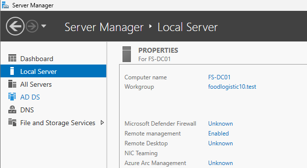 


***

### 2.2 Creación del dominio

Se instala el rol **Active Directory Domain Services** y se promociona el servidor como controlador de dominio principal, creando un nuevo bosque con el dominio `foodlogistic10.test`.

***

## 3. Organización de Active Directory

### 3.1 Estructura de OUs

Se crea la siguiente estructura:

    foodlogistic10.test
    └── FoodLogistic
        ├── Users
        ├── Groups
        └── Computers

Esta organización facilita la gestión de usuarios, grupos y políticas de grupo.

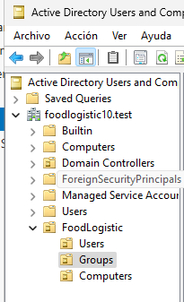 

***

### 3.2 Grupos de seguridad

Se crean los grupos de seguridad (Global / Security):

| Grupo         | Función                    |
| ------------- | -------------------------- |
| Administracio | Facturas y albaranes       |
| Transport     | Logística y operaciones    |
| Direccio      | Documentación confidencial |

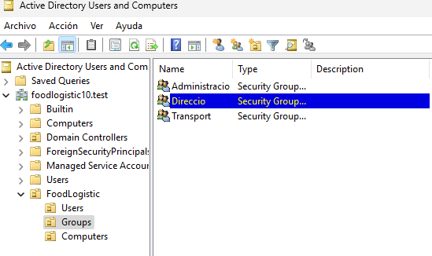 

***

### 3.3 Usuarios de prueba

| Usuario | Grupo         |
| ------- | ------------- |
| admin1  | Administracio |
| trans1  | Transport     |
| direc1  | Direccio      |

 


***

## 4. Preparación del servidor de ficheros

Se utiliza un disco de datos independiente:

    D:\DATA
    ├── Public
    ├── Operacions
    └── Direccio

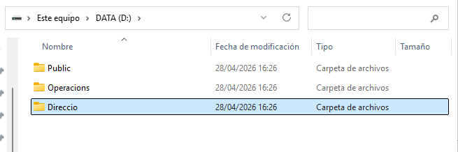 


***

## 5. Carpeta Public (Explorador de archivos)

### 5.1 Permisos NTFS

Configuración:

*   Administrators → Control total
*   SYSTEM → Control total
*   Domain Users → Modificar

Se deshabilita la herencia y se eliminan permisos innecesarios.

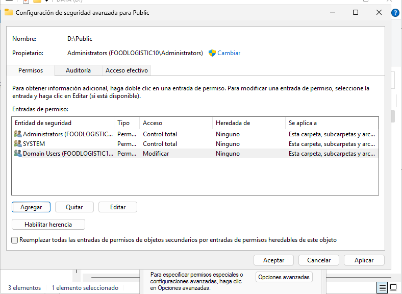 


***

### 5.2 Compartición SMB

*   Recurso compartido: `Public`
*   Permisos SMB:
    *   Everyone → Leer

> El permiso efectivo final es de solo lectura, ya que SMB es más restrictivo que NTFS.

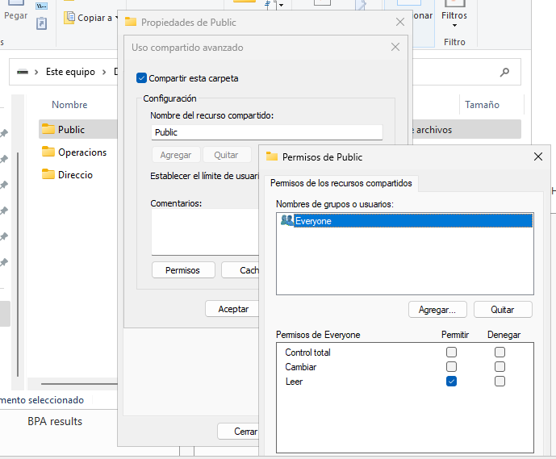 


***

## 6. Carpeta Operacions (Server Manager)

La carpeta se comparte usando **Server Manager**.

Configuración:

*   Recurso: `Operacions`
*   Access-Based Enumeration: activado
*   Permisos SMB:
    *   Transport → Control total

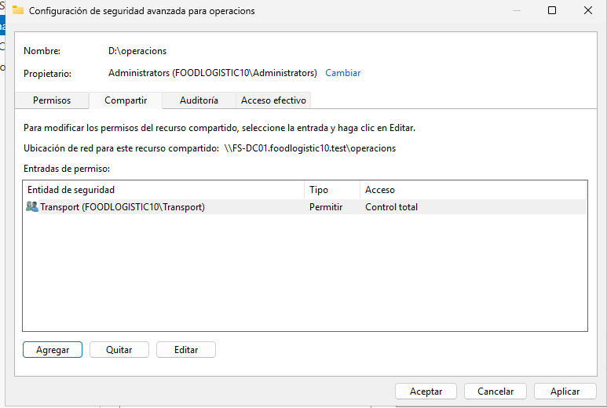 


***

### 6.1 Permisos NTFS

*   Administrators → Control total
*   SYSTEM → Control total
*   Transport → Modificar

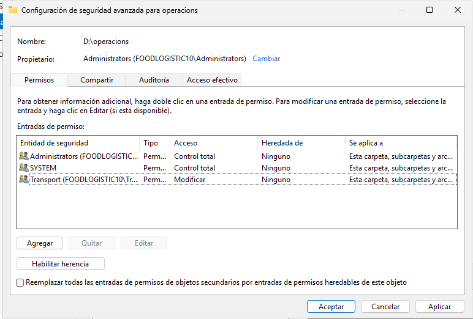 


***

## 7. Carpeta Direccio (PowerShell + GPO)

### 7.1 Permisos NTFS

*   Administrators → Control total
*   SYSTEM → Control total
*   Direccio → Modificar

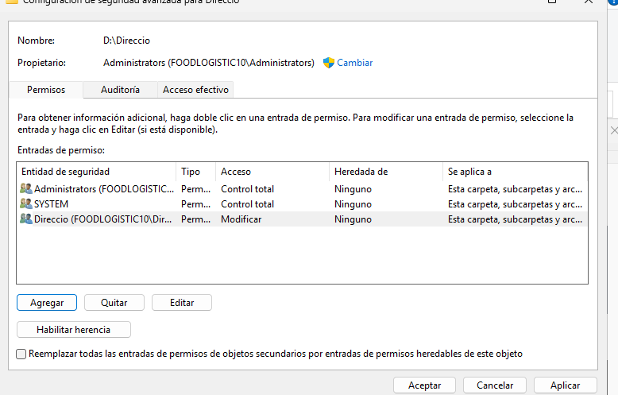 


***

### 7.2 Compartición con PowerShell

```powershell
New-SmbShare `
 -Name "Direccio" `
 -Path "D:\Direccio" `
 -FullAccess "FOODLOGISTIC10\Direccio" `
 -FolderEnumerationMode AccessBased
```

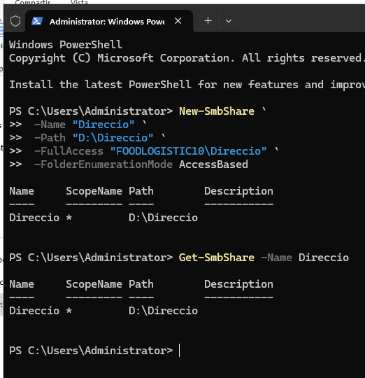 


***

### 7.3 Mapeo de unidad Z: por GPO

GPO: `Map_Direccio_Z`

*   User Configuration → Preferences → Drive Maps
*   Ruta: `\\FS-DC01\Direccio`
*   Letra: Z:
*   Item-level targeting: grupo *Direccio*

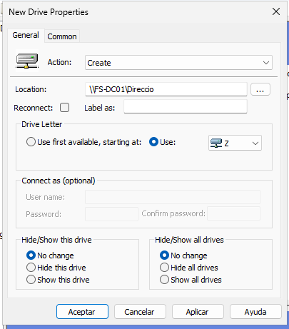 

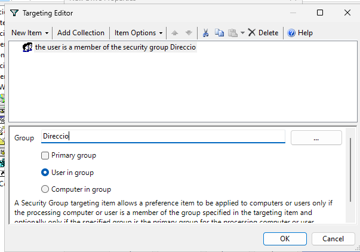 

***

## 8. Control de almacenamiento

### 8.1 Cuotas NTFS (volumen)

En el disco de datos:

*   Límite por usuario: 500 MB
*   Denegar espacio al superar el límite

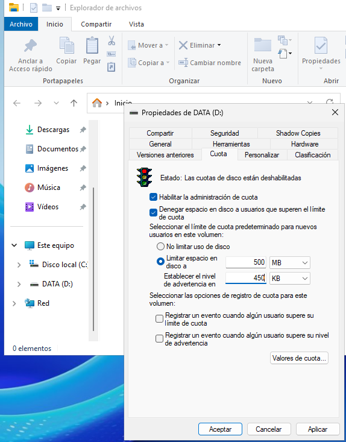 


***

### 8.2 FSRM – Cuota en Public

*   Carpeta: `D:\Public`
*   Límite: 200 MB
*   Tipo: Hard quota
*   Aviso al 90 % con mensaje personalizado

Mensaje:

    Compte! FoodLogístic t'informa que estàs a punt d'esgotar l'espai compartit.

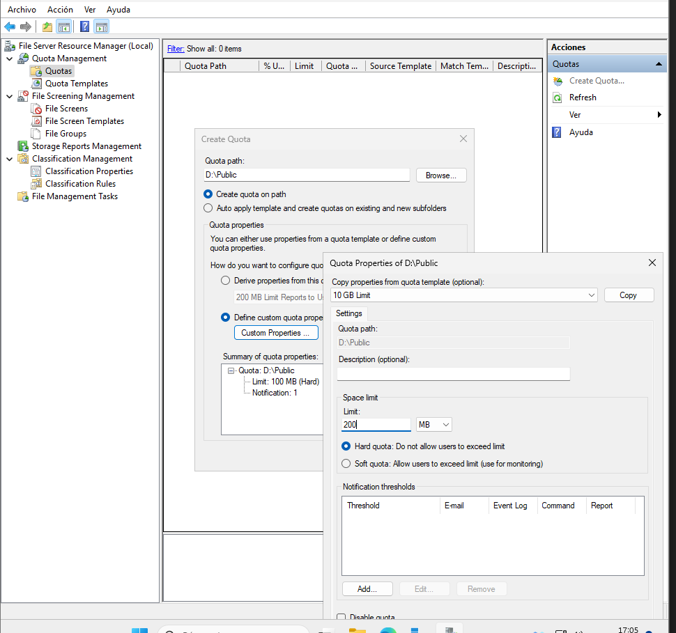 

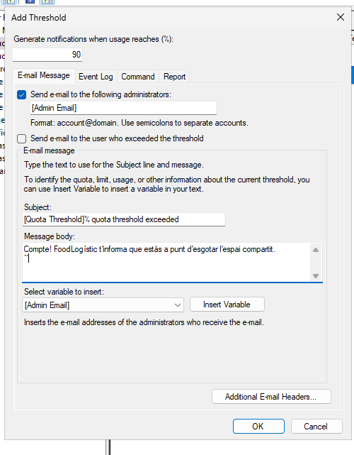 

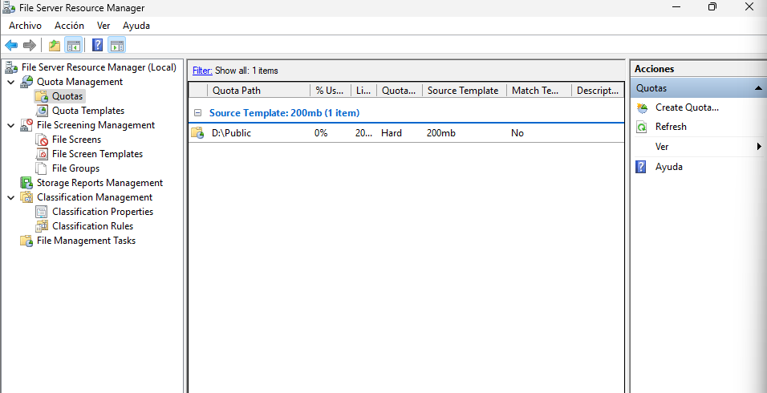 


***

### 8.3 FSRM – Filtrado en Operacions

*   Filtrado activo
*   Bloqueo de:
    *   Ejecutables (.exe, .msi)
    *   Audio y vídeo

 


***

## 9. Verificación desde el cliente

### 9.1 Usuario `trans1`

*   Ve Direccio (solo lectura)
*   No puede escribir en Direcci¡o

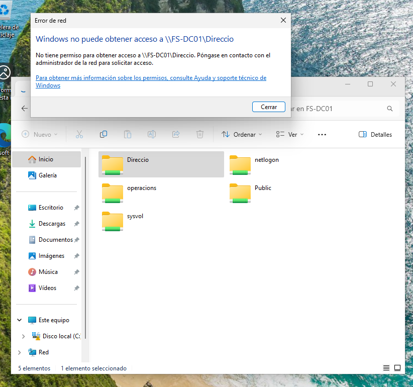 


***

### 9.2 Usuario `trans1`

*   Ve Public y Operacions
*   No tiene acceso a Direccio
*   FSRM bloquea `.exe` y multimedia

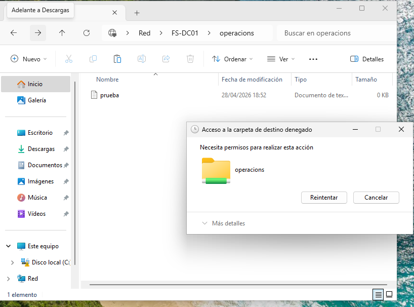 


***

### 9.3 Usuario `direc1`

*   Aparece la unidad **Z:**
*   Accede correctamente a Direccio
*   No ve Operacions

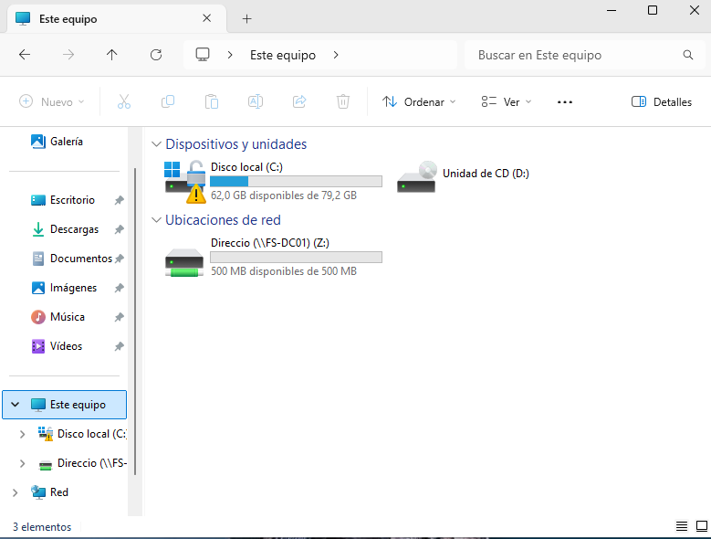 


***

## 10. Conclusión

Se ha implementado con éxito un servidor de archivos centralizado que cumple los requisitos de seguridad, organización y control de espacio solicitados. La solución garantiza que cada departamento accede únicamente a la información que le corresponde, aplicando buenas prácticas profesionales en entornos Windows Server.

