## Implantación de una intranet empresarial con WordPress

**Empresa:** malambo  
**Autor:** Santiago Hernandez

***

## 1. Introducción

El objetivo de este proyecto es la implantación de una intranet empresarial basada en WordPress para la empresa *malambo*.  
La intranet permite a los trabajadores compartir documentos, trabajar con ofimática web, organizar calendarios, gestionar tareas y acceder a la información desde un único portal web.

La solución se ha desarrollado en un entorno local de pruebas utilizando WordPress y diferentes plugins.

***

## 2. Arquitectura de la solución

La arquitectura básica del sistema es la siguiente:

Servidor local (Local WP)  
→ WordPress  
→ Plugins específicos para cada servicio

Servicios implementados:

*   Gestor de archivos
*   Ofimática web
*   Calendario de eventos
*   Gestión de proyectos y tareas
*   Control de usuarios y permisos

***

## 3. Fase 1 – Instalación del entorno (RA3)

### 3.1 Instalación de Local WP

Se ha instalado Local WP para crear un entorno local que incluye servidor web, PHP, base de datos e instalación automática de WordPress.

*   Instalador de Local WP
*   Pantalla inicial de Local WP

***

### 3.2 Creación del sitio WordPress

Desde Local WP se ha creado un nuevo sitio con los siguientes datos:

*   Nombre del sitio:  
    `malambo-intranet-santiago-hernandez`
*   Tipo de entorno: Preferred

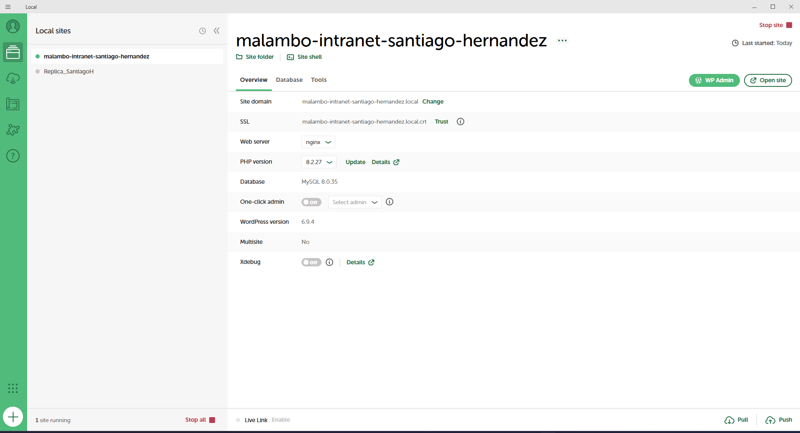 

*   Resumen del sitio creado en Local WP

***

### 3.3 Usuario administrador

Durante la instalación se creó el usuario administrador:

*   Usuario: `admin`
*   Correo: `dev-email@wpengine.local`
*   Formulario de creación del usuario administrador

***

### 3.4 Acceso al panel de administración

Se accedió al panel de WordPress mediante:

    /wp-admin

*   Escritorio principal de WordPress

***

### 3.5 Configuración básica

En **Ajustes → Generales** se configuraron:

*   Título del sitio
*   Descripción
*   Idioma
*   Zona horaria (Europa/Madrid)

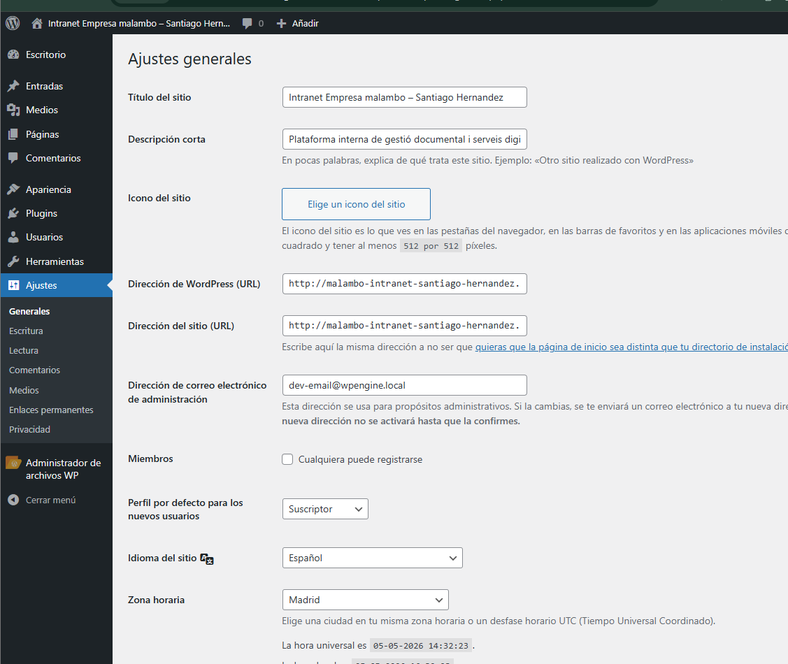 

*   Pantalla de Ajustes Generales

***

### 3.6 Configuración de enlaces permanentes

En **Ajustes → Enlaces permanentes** se seleccionó:

*   Opción: Nombre de la entrada

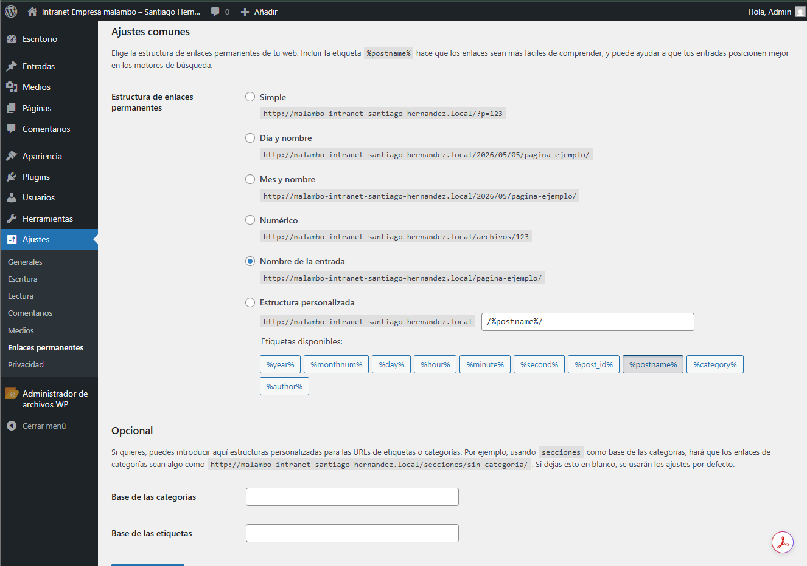 

*   Enlaces permanentes configurados

***

## 4. Fase 2 – Gestor documental (RA3)

### 4.1 Instalación del gestor de archivos

Se instaló y activó el plugin **WP File Manager** para la gestión de archivos desde la intranet.

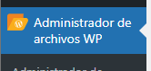 

*   Plugin WP File Manager instalado y activado

***

### 4.2 Configuración básica y seguridad

El gestor de archivos se configuró para:

*   Uso exclusivo por el administrador
*   Trabajo dentro de la carpeta `uploads`
*   Evitar acceso a archivos críticos del sistema
*   Acceso al gestor de archivos mostrando la ruta de trabajo

***

### 4.3 Creación de la estructura de carpetas

Se creó la siguiente estructura documental:

    Empresa-malambo-Santiago-Hernandez
    ├── Documents
    ├── Projectes
    ├── Recursos
    └── Clients

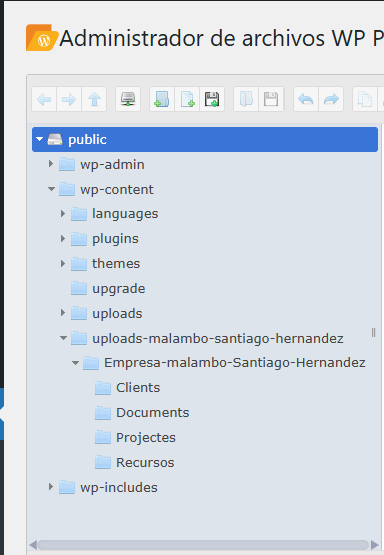 

*   Árbol de carpetas creado

***

### 4.4 Subida y clasificación de archivos

Se subieron archivos de prueba:

*   PDF en Documents
*   Documento de texto en Projectes
*   Imagen en Recursos
*   Archivo relacionado con cliente en Clients

Todos los archivos incluyen referencia al autor.

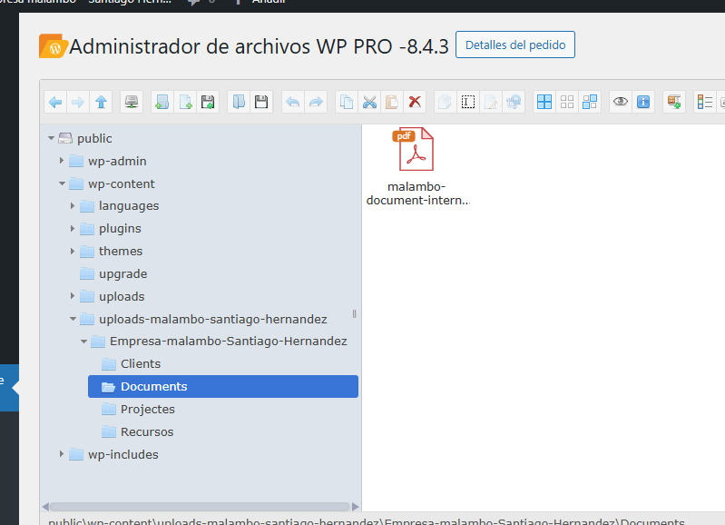 

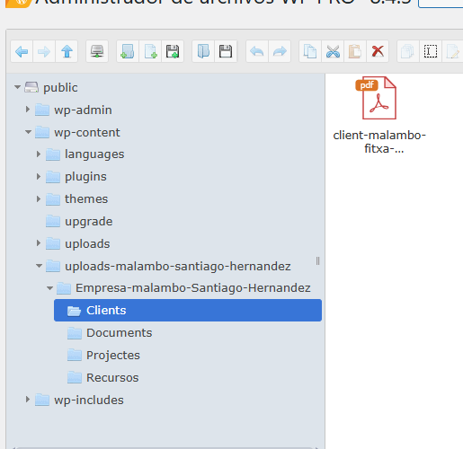 

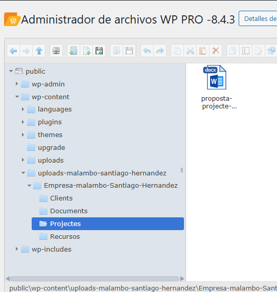 

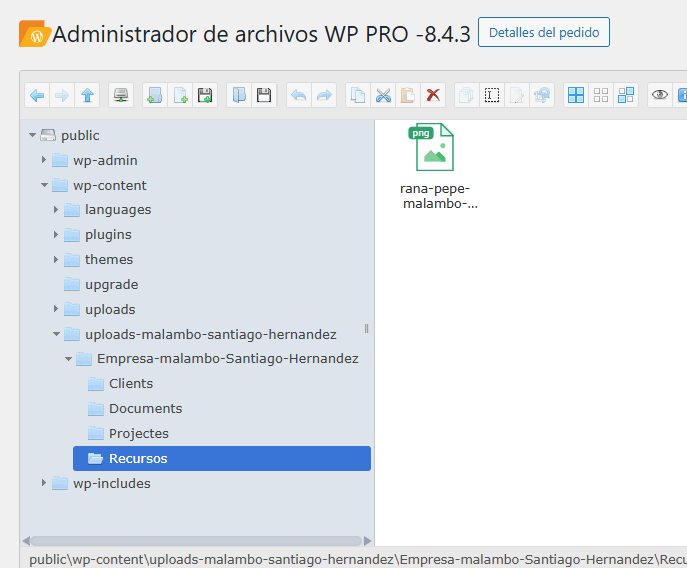 

*   Carpetas con archivos correctamente clasificados

***

### 4.5 Creación de usuarios y roles

Se crearon los siguientes usuarios:

*   Admin – Administrador
*   director.santiagohernandez – Editor
*   trabajador.santiagohernandez – Autor
*   externo.santiagohernandez – Suscriptor

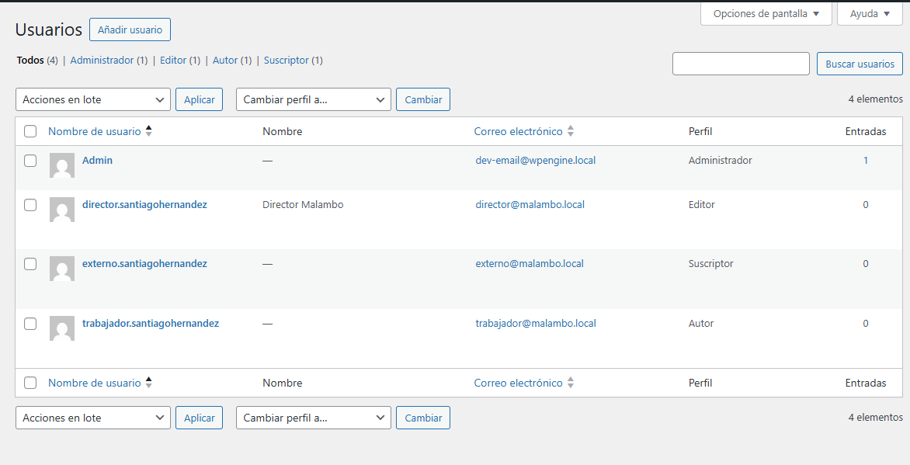 

*   Lista de usuarios con sus roles

***

### 4.6 Pruebas de permisos

Se realizaron pruebas iniciando sesión con cada usuario:

*   **Subscriber:** acceso solo lectura
*   **Author:** creación y edición de contenido propio
*   **Editor:** edición general de contenidos
*   **Administrador:** control total del sistema

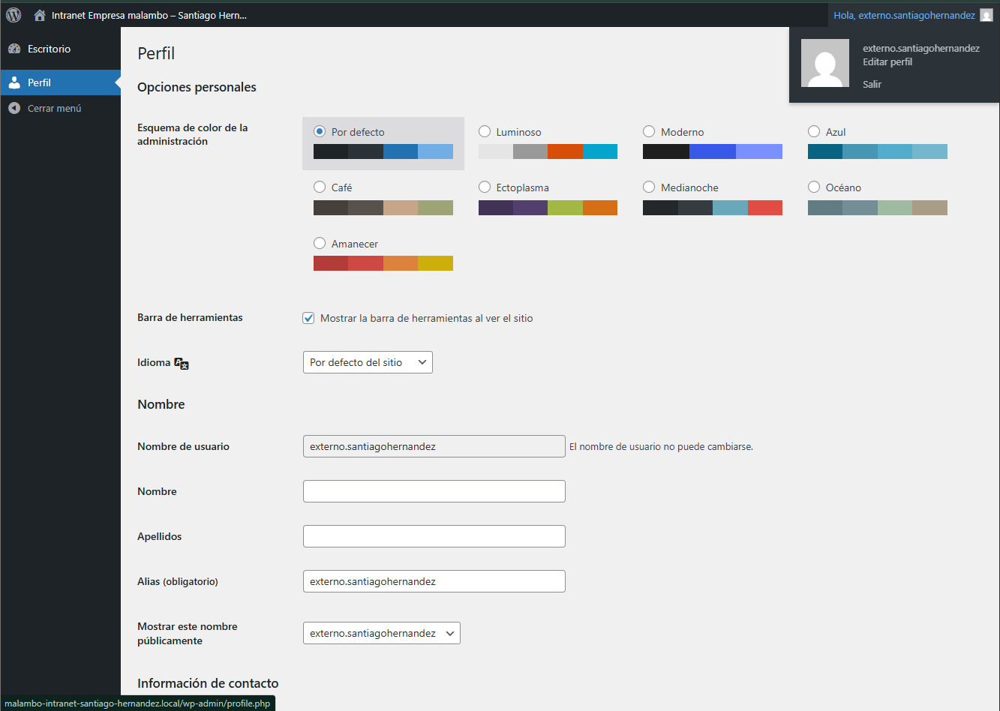 

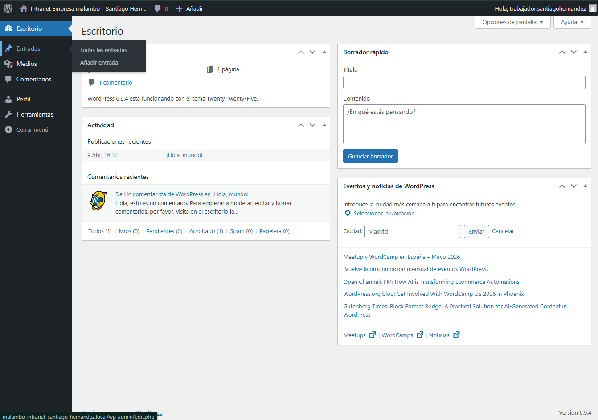 

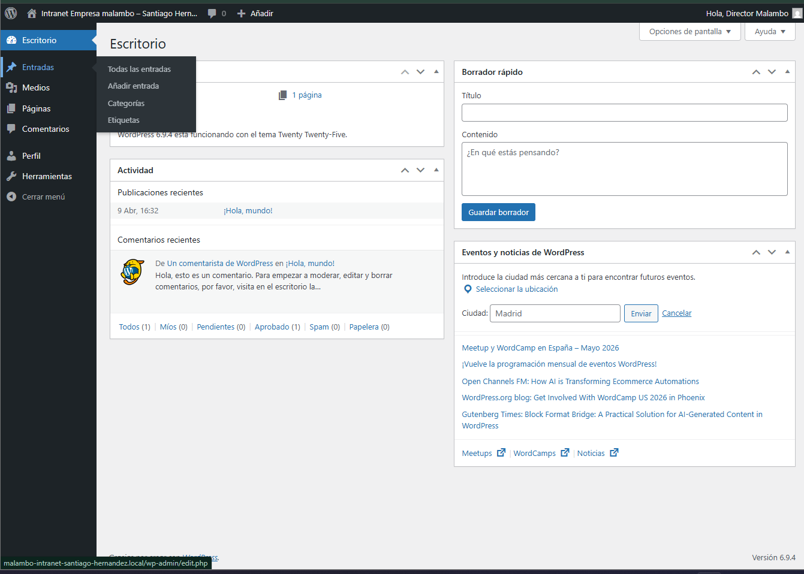 

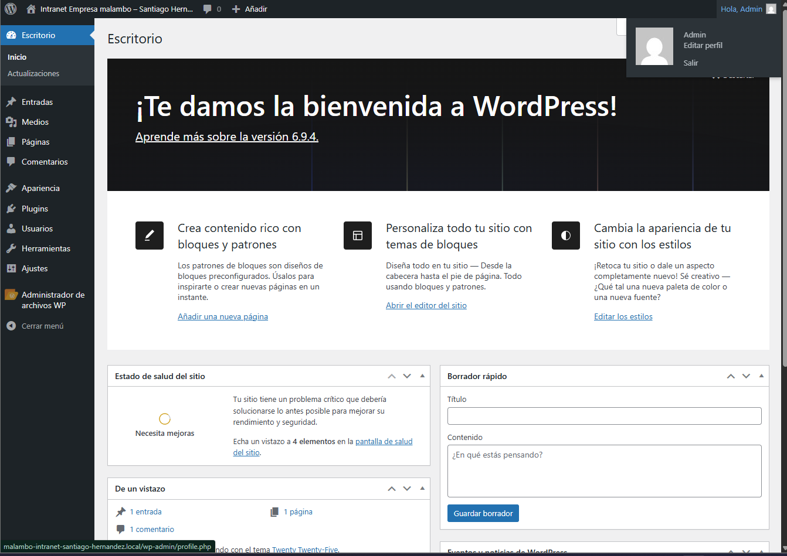 

*   Escritorio del usuario Subscriber
*   Panel del usuario Author
*   Acceso del Editor a contenidos
*   Panel completo del Administrador

***

### 4.7 Pruebas de gestión de archivos

Como administrador se probó:

*   Abrir archivos
*   Subir nuevos documentos
*   Renombrar archivos
*   Mover archivos entre carpetas

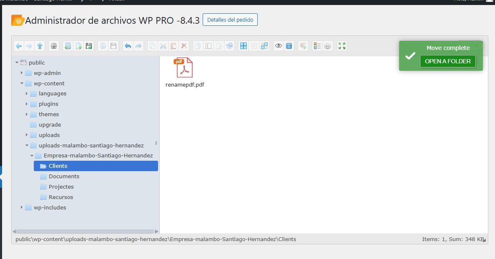 

*   Acciones realizadas en el gestor de archivos

***

### 4.8 Comprobación de seguridad

Se verificó que:

*   El gestor solo es accesible por el administrador
*   El sistema se ejecuta en entorno local
*   No se manejan credenciales sensibles
*   Vista del gestor con acceso restringido

***

## 5. Fase 3 – Ofimática web (RA4)

### 5.1 Creación de documentos

Se crearon tres documentos en Google:

*   Documento de texto
*   Hoja de cálculo
*   Presentación

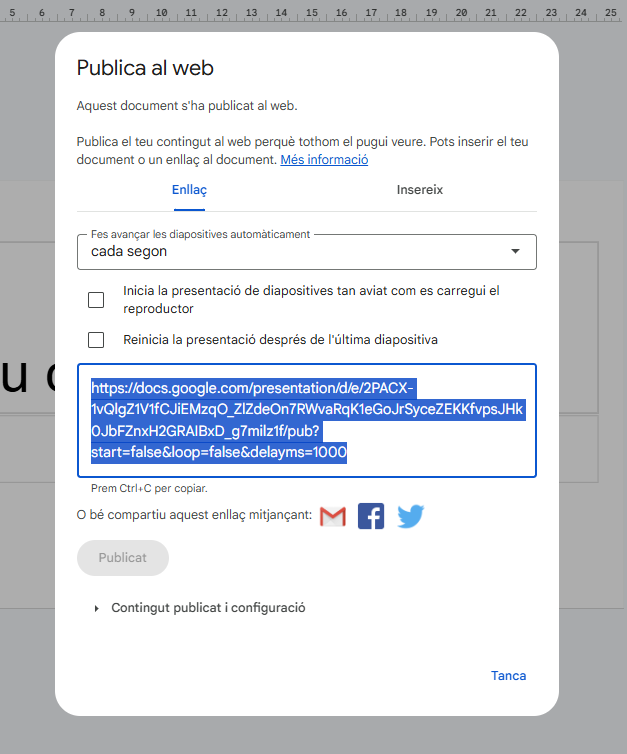 

*   Cada documento abierto en Google Docs

***

### 5.2 Instalación del plugin de incrustación

Documentos creados y subidos a una pagina con formato HTML, puesto con los link que se genera con la opcion de compartir web dentro del archivo. (No es el mismo enlace de compartir normal)

 

***

### 5.3 Creación de la página “Oficina digital malambo”

Se creó una página donde se incrustaron los documentos mediante el método “Publicar en la web” y código iframe.

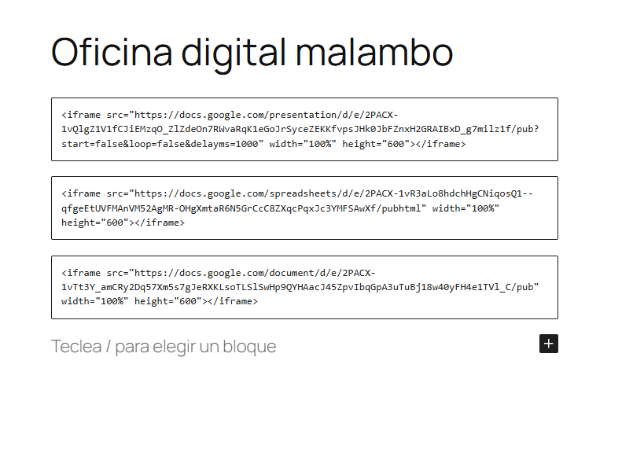 

*   Página mostrando los tres documentos incrustados

***

## 6. Fase 4 – Aplicaciones web de escritorio (RA5)

### 6.1 Instalación del calendario

Se instaló el plugin **The Events Calendar**.

 

*   Plugin activado

***

### 6.2 Creación de eventos

Se crearon tres eventos empresariales con título, fecha y descripción.

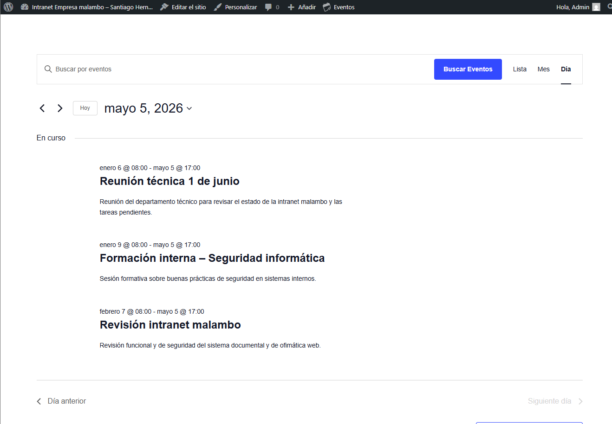 

*   Lista de eventos creados

***

### 6.3 Página “Calendari malambo”

Se creó una página para mostrar el calendario completo.

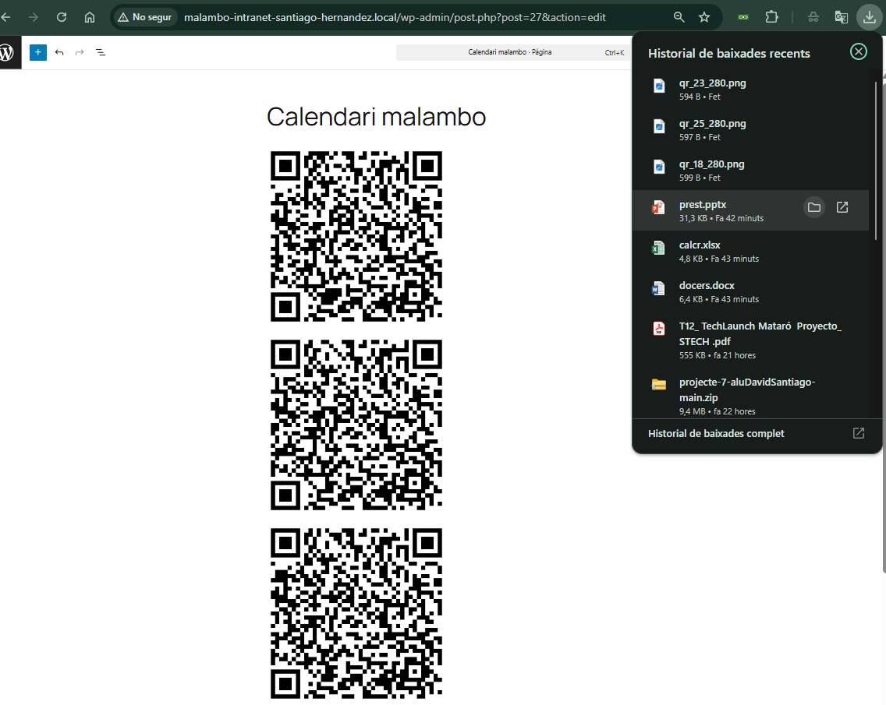 

*   Calendario visible con eventos

***

### 6.4 Instalación del gestor de proyectos

Se instaló el plugin **WP Project Manager** (weDevs).

*   Plugin activo en la lista

***

### 6.5 Creación del proyecto

Se creó el proyecto:

    Implementació intranet malambo – Santiago Hernandez

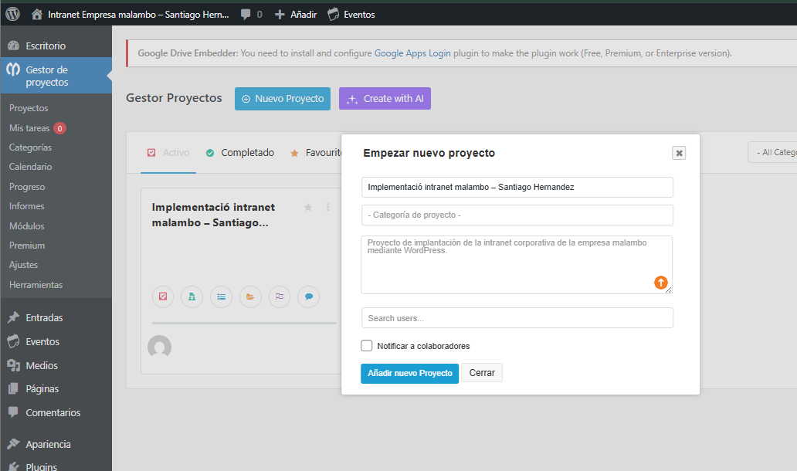 

*   Proyecto creado y abierto

***

### 6.6 Creación y gestión de tareas

Se crearon tres tareas con distintos estados:

*   Completada
*   En proceso
*   Pendiente

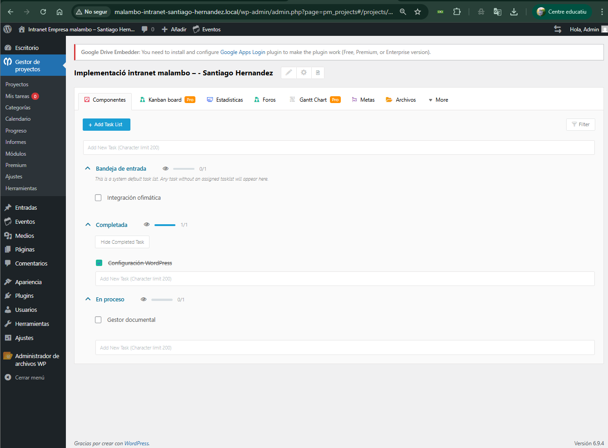 

*   Tareas visibles con sus estados

***

### 6.7 Pruebas finales de funcionamiento

Se comprobó:

*   Acceso al proyecto
*   Cambio de estado de tareas
*   Visualización del progreso

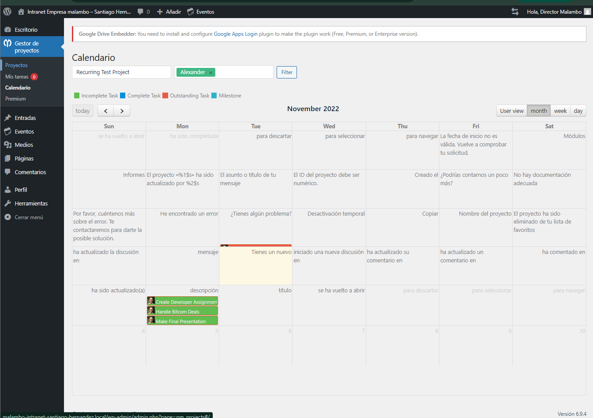 

*   Cambio de estado de una tarea

***

## 7. Conclusión

El proyecto cumple con los objetivos planteados inicialmente.  
La intranet desarrollada permite gestionar documentos, trabajar con ofimática web, organizar eventos y controlar proyectos y tareas, simulando un entorno real de una empresa.

La solución es escalable y podría ampliarse en un entorno de producción con medidas adicionales de seguridad.

